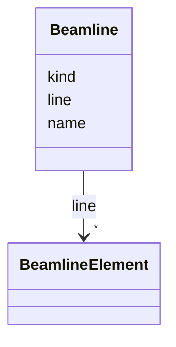

# Class: Beamline 


_An ordered sequence of beamline elements defining a beam path._


URI: [https://w3id.org/narad_linkml/schema/narad/schema/Beamline](https://w3id.org/narad_linkml/schema/narad/schema/Beamline)





<!-- no inheritance hierarchy -->


## Slots

| Name | Cardinality and Range | Description | Inheritance |
| ---  | --- | --- | --- |
| [name](name.md) | 1 <br/> [String](String.md) | Name/identifier of the entity | direct |
| [kind](kind.md) | 0..1 <br/> [String](String.md) | Kind/type of the profile family or profile instance | direct |
| [line](line.md) | * <br/> [BeamlineElement](BeamlineElement.md) | Ordered sequence of cross-referenced element names forming a beamline | direct |


## Usages

| used by | used in | type | used |
| ---  | --- | --- | --- |
| [NaradModel](NaradModel.md) | [beamlines](beamlines.md) | range | [Beamline](Beamline.md) |


## Identifier and Mapping Information


### Schema Source


* from schema: https://w3id.org/narad_linkml/schema/narad/schema


## Mappings

| Mapping Type | Mapped Value |
| ---  | ---  |
| self | https://w3id.org/narad_linkml/schema/narad/schema/Beamline |
| native | https://w3id.org/narad_linkml/schema/narad/schema/Beamline |


## LinkML Source

<!-- TODO: investigate https://stackoverflow.com/questions/37606292/how-to-create-tabbed-code-blocks-in-mkdocs-or-sphinx -->

### Direct

<details>
```yaml
name: Beamline
description: An ordered sequence of beamline elements defining a beam path.
from_schema: https://w3id.org/narad_linkml/schema/narad/schema
slots:
- name
- kind
- line

```
</details>

### Induced

<details>
```yaml
name: Beamline
description: An ordered sequence of beamline elements defining a beam path.
from_schema: https://w3id.org/narad_linkml/schema/narad/schema
attributes:
  name:
    name: name
    description: Name/identifier of the entity.
    from_schema: https://w3id.org/narad_linkml/schema/narad/schema
    rank: 1000
    identifier: true
    alias: name
    owner: Beamline
    domain_of:
    - Facility
    - SignalBinding
    - DeviceTypeSignalSet
    - Signal
    - Capability
    - CapabilityProfile
    - ControlProfileFamily
    - Beamline
    - BeamlineElement
    - PVBinding
    - KeyValuePair
    range: string
    required: true
  kind:
    name: kind
    description: Kind/type of the profile family or profile instance.
    from_schema: https://w3id.org/narad_linkml/schema/narad/schema
    aliases:
    - type
    - profile_type
    rank: 1000
    alias: kind
    owner: Beamline
    domain_of:
    - CapabilityProfile
    - ControlProfileFamily
    - Beamline
    - BeamlineElement
    range: string
  line:
    name: line
    description: Ordered sequence of cross-referenced element names forming a beamline.
    from_schema: https://w3id.org/narad_linkml/schema/narad/schema
    rank: 1000
    alias: line
    owner: Beamline
    domain_of:
    - Beamline
    range: BeamlineElement
    multivalued: true
    inlined: false

```
</details>