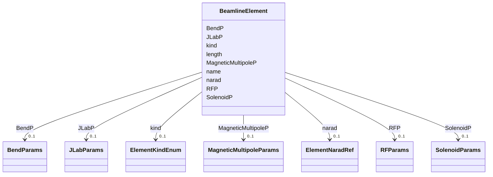

# Class: BeamlineElement 


_A single element in a beamline with optional physics parameter blocks._


URI: [https://w3id.org/narad_linkml/schema/narad/schema/BeamlineElement](https://w3id.org/narad_linkml/schema/narad/schema/BeamlineElement)





<!-- no inheritance hierarchy -->


## Slots

| Name | Cardinality and Range | Description | Inheritance |
| ---  | --- | --- | --- |
| [name](name.md) | 1 <br/> [String](String.md) | Name/identifier of the entity | direct |
| [kind](kind.md) | 0..1 <br/> [ElementKindEnum](ElementKindEnum.md) | Kind/type of the profile family or profile instance | direct |
| [length](length.md) | 0..1 <br/> [Float](Float.md) | Physical length of the element in meters | direct |
| [RFP](RFP.md) | 0..1 <br/> [RFParams](RFParams.md) | RF cavity physics parameters block | direct |
| [BendP](BendP.md) | 0..1 <br/> [BendParams](BendParams.md) | Dipole/bend physics parameters block | direct |
| [MagneticMultipoleP](MagneticMultipoleP.md) | 0..1 <br/> [MagneticMultipoleParams](MagneticMultipoleParams.md) | Magnetic multipole physics parameters block | direct |
| [SolenoidP](SolenoidP.md) | 0..1 <br/> [SolenoidParams](SolenoidParams.md) | Solenoid physics parameters block | direct |
| [narad](narad.md) | 0..1 <br/> [ElementNaradRef](ElementNaradRef.md) |  | direct |
| [JLabP](JLabP.md) | 0..1 <br/> [JLabParams](JLabParams.md) | JLab-specific element parameters block | direct |


## Usages

| used by | used in | type | used |
| ---  | --- | --- | --- |
| [NaradModel](NaradModel.md) | [elements](elements.md) | range | [BeamlineElement](BeamlineElement.md) |
| [Beamline](Beamline.md) | [line](line.md) | range | [BeamlineElement](BeamlineElement.md) |


## Identifier and Mapping Information


### Schema Source


* from schema: https://w3id.org/narad_linkml/schema/narad/schema


## Mappings

| Mapping Type | Mapped Value |
| ---  | ---  |
| self | https://w3id.org/narad_linkml/schema/narad/schema/BeamlineElement |
| native | https://w3id.org/narad_linkml/schema/narad/schema/BeamlineElement |


## LinkML Source

<!-- TODO: investigate https://stackoverflow.com/questions/37606292/how-to-create-tabbed-code-blocks-in-mkdocs-or-sphinx -->

### Direct

<details>
```yaml
name: BeamlineElement
description: A single element in a beamline with optional physics parameter blocks.
from_schema: https://w3id.org/narad_linkml/schema/narad/schema
slots:
- name
- kind
- length
- RFP
- BendP
- MagneticMultipoleP
- SolenoidP
- narad
- JLabP
slot_usage:
  kind:
    name: kind
    range: ElementKindEnum
  narad:
    name: narad
    range: ElementNaradRef

```
</details>

### Induced

<details>
```yaml
name: BeamlineElement
description: A single element in a beamline with optional physics parameter blocks.
from_schema: https://w3id.org/narad_linkml/schema/narad/schema
slot_usage:
  kind:
    name: kind
    range: ElementKindEnum
  narad:
    name: narad
    range: ElementNaradRef
attributes:
  name:
    name: name
    description: Name/identifier of the entity.
    from_schema: https://w3id.org/narad_linkml/schema/narad/schema
    rank: 1000
    identifier: true
    alias: name
    owner: BeamlineElement
    domain_of:
    - Facility
    - SignalBinding
    - DeviceTypeSignalSet
    - Signal
    - Capability
    - CapabilityProfile
    - ControlProfileFamily
    - Beamline
    - BeamlineElement
    - PVBinding
    - KeyValuePair
    range: string
    required: true
  kind:
    name: kind
    description: Kind/type of the profile family or profile instance.
    from_schema: https://w3id.org/narad_linkml/schema/narad/schema
    aliases:
    - type
    - profile_type
    rank: 1000
    alias: kind
    owner: BeamlineElement
    domain_of:
    - CapabilityProfile
    - ControlProfileFamily
    - Beamline
    - BeamlineElement
    range: ElementKindEnum
  length:
    name: length
    description: Physical length of the element in meters.
    from_schema: https://w3id.org/narad_linkml/schema/narad/schema
    rank: 1000
    alias: length
    owner: BeamlineElement
    domain_of:
    - BeamlineElement
    range: float
  RFP:
    name: RFP
    description: RF cavity physics parameters block.
    from_schema: https://w3id.org/narad_linkml/schema/narad/schema
    rank: 1000
    alias: RFP
    owner: BeamlineElement
    domain_of:
    - BeamlineElement
    range: RFParams
    inlined: true
  BendP:
    name: BendP
    description: Dipole/bend physics parameters block.
    from_schema: https://w3id.org/narad_linkml/schema/narad/schema
    rank: 1000
    alias: BendP
    owner: BeamlineElement
    domain_of:
    - BeamlineElement
    range: BendParams
    inlined: true
  MagneticMultipoleP:
    name: MagneticMultipoleP
    description: Magnetic multipole physics parameters block.
    from_schema: https://w3id.org/narad_linkml/schema/narad/schema
    rank: 1000
    alias: MagneticMultipoleP
    owner: BeamlineElement
    domain_of:
    - BeamlineElement
    range: MagneticMultipoleParams
    inlined: true
  SolenoidP:
    name: SolenoidP
    description: Solenoid physics parameters block.
    from_schema: https://w3id.org/narad_linkml/schema/narad/schema
    rank: 1000
    alias: SolenoidP
    owner: BeamlineElement
    domain_of:
    - BeamlineElement
    range: SolenoidParams
    inlined: true
  narad:
    name: narad
    from_schema: https://w3id.org/narad_linkml/schema/narad/schema
    rank: 1000
    alias: narad
    owner: BeamlineElement
    domain_of:
    - NaradModel
    - BeamlineElement
    range: ElementNaradRef
    inlined: true
  JLabP:
    name: JLabP
    description: JLab-specific element parameters block.
    from_schema: https://w3id.org/narad_linkml/schema/narad/schema
    rank: 1000
    alias: JLabP
    owner: BeamlineElement
    domain_of:
    - BeamlineElement
    range: JLabParams
    inlined: true

```
</details>