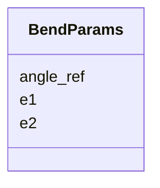

# Class: BendParams 


_Dipole/bend physics parameters (entry angle, exit edge angles)._


URI: [https://w3id.org/narad_linkml/schema/narad/schema/BendParams](https://w3id.org/narad_linkml/schema/narad/schema/BendParams)





<!-- no inheritance hierarchy -->


## Slots

| Name | Cardinality and Range | Description | Inheritance |
| ---  | --- | --- | --- |
| [angle_ref](angle_ref.md) | 0..1 <br/> [Float](Float.md) | Reference bend angle in radians | direct |
| [e1](e1.md) | 0..1 <br/> [Float](Float.md) | Entry edge angle in radians | direct |
| [e2](e2.md) | 0..1 <br/> [Float](Float.md) | Exit edge angle in radians | direct |


## Usages

| used by | used in | type | used |
| ---  | --- | --- | --- |
| [BeamlineElement](BeamlineElement.md) | [BendP](BendP.md) | range | [BendParams](BendParams.md) |


## Identifier and Mapping Information


### Schema Source


* from schema: https://w3id.org/narad_linkml/schema/narad/schema


## Mappings

| Mapping Type | Mapped Value |
| ---  | ---  |
| self | https://w3id.org/narad_linkml/schema/narad/schema/BendParams |
| native | https://w3id.org/narad_linkml/schema/narad/schema/BendParams |


## LinkML Source

<!-- TODO: investigate https://stackoverflow.com/questions/37606292/how-to-create-tabbed-code-blocks-in-mkdocs-or-sphinx -->

### Direct

<details>
```yaml
name: BendParams
description: Dipole/bend physics parameters (entry angle, exit edge angles).
from_schema: https://w3id.org/narad_linkml/schema/narad/schema
slots:
- angle_ref
- e1
- e2

```
</details>

### Induced

<details>
```yaml
name: BendParams
description: Dipole/bend physics parameters (entry angle, exit edge angles).
from_schema: https://w3id.org/narad_linkml/schema/narad/schema
attributes:
  angle_ref:
    name: angle_ref
    description: Reference bend angle in radians.
    from_schema: https://w3id.org/narad_linkml/schema/narad/schema
    rank: 1000
    alias: angle_ref
    owner: BendParams
    domain_of:
    - BendParams
    range: float
  e1:
    name: e1
    description: Entry edge angle in radians.
    from_schema: https://w3id.org/narad_linkml/schema/narad/schema
    rank: 1000
    alias: e1
    owner: BendParams
    domain_of:
    - BendParams
    range: float
  e2:
    name: e2
    description: Exit edge angle in radians.
    from_schema: https://w3id.org/narad_linkml/schema/narad/schema
    rank: 1000
    alias: e2
    owner: BendParams
    domain_of:
    - BendParams
    range: float

```
</details>