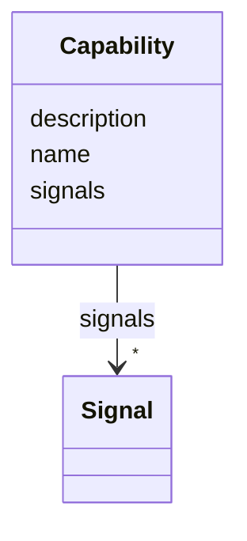

# Class: Capability 


_A grouping of related signals for a control aspect._


URI: [https://w3id.org/narad_linkml/schema/narad/schema/Capability](https://w3id.org/narad_linkml/schema/narad/schema/Capability)





<!-- no inheritance hierarchy -->


## Slots

| Name | Cardinality and Range | Description | Inheritance |
| ---  | --- | --- | --- |
| [name](name.md) | 1 <br/> [String](String.md) | Name/identifier of the entity | direct |
| [description](description.md) | 0..1 <br/> [String](String.md) |  | direct |
| [signals](signals.md) | * <br/> [Signal](Signal.md) | Signals within a capability | direct |


## Usages

| used by | used in | type | used |
| ---  | --- | --- | --- |
| [ControlProfileFamily](ControlProfileFamily.md) | [shared_capabilities](shared_capabilities.md) | range | [Capability](Capability.md) |
| [ElementSemantics](ElementSemantics.md) | [shared_capabilities](shared_capabilities.md) | range | [Capability](Capability.md) |


## Identifier and Mapping Information


### Schema Source


* from schema: https://w3id.org/narad_linkml/schema/narad/schema


## Mappings

| Mapping Type | Mapped Value |
| ---  | ---  |
| self | https://w3id.org/narad_linkml/schema/narad/schema/Capability |
| native | https://w3id.org/narad_linkml/schema/narad/schema/Capability |


## LinkML Source

<!-- TODO: investigate https://stackoverflow.com/questions/37606292/how-to-create-tabbed-code-blocks-in-mkdocs-or-sphinx -->

### Direct

<details>
```yaml
name: Capability
description: A grouping of related signals for a control aspect.
from_schema: https://w3id.org/narad_linkml/schema/narad/schema
slots:
- name
- description
- signals

```
</details>

### Induced

<details>
```yaml
name: Capability
description: A grouping of related signals for a control aspect.
from_schema: https://w3id.org/narad_linkml/schema/narad/schema
attributes:
  name:
    name: name
    description: Name/identifier of the entity.
    from_schema: https://w3id.org/narad_linkml/schema/narad/schema
    rank: 1000
    identifier: true
    alias: name
    owner: Capability
    domain_of:
    - Facility
    - SignalBinding
    - DeviceTypeSignalSet
    - Signal
    - Capability
    - CapabilityProfile
    - ControlProfileFamily
    - Beamline
    - BeamlineElement
    - PVBinding
    - KeyValuePair
    range: string
    required: true
  description:
    name: description
    from_schema: https://w3id.org/narad_linkml/schema/narad/schema
    rank: 1000
    alias: description
    owner: Capability
    domain_of:
    - SignalBinding
    - Signal
    - Capability
    - TypeSpecificCapability
    - CapabilityProfile
    - ControlProfileFamily
    range: string
  signals:
    name: signals
    description: Signals within a capability.
    from_schema: https://w3id.org/narad_linkml/schema/narad/schema
    rank: 1000
    alias: signals
    owner: Capability
    domain_of:
    - Capability
    - TypeSpecificCapability
    range: Signal
    multivalued: true
    inlined: true
    inlined_as_list: true

```
</details>