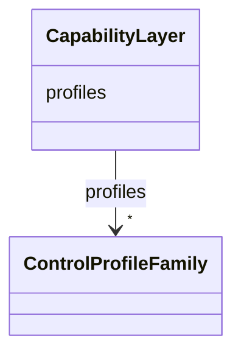

# Class: CapabilityLayer 


_Capability-layer container for profile families._


URI: [https://w3id.org/narad_linkml/schema/narad/schema/CapabilityLayer](https://w3id.org/narad_linkml/schema/narad/schema/CapabilityLayer)





<!-- no inheritance hierarchy -->


## Slots

| Name | Cardinality and Range | Description | Inheritance |
| ---  | --- | --- | --- |
| [profiles](profiles.md) | * <br/> [ControlProfileFamily](ControlProfileFamily.md) | Control profile families keyed by family name | direct |


## Usages

| used by | used in | type | used |
| ---  | --- | --- | --- |
| [NaradConfig](NaradConfig.md) | [capability_layer](capability_layer.md) | range | [CapabilityLayer](CapabilityLayer.md) |


## Identifier and Mapping Information


### Schema Source


* from schema: https://w3id.org/narad_linkml/schema/narad/schema


## Mappings

| Mapping Type | Mapped Value |
| ---  | ---  |
| self | https://w3id.org/narad_linkml/schema/narad/schema/CapabilityLayer |
| native | https://w3id.org/narad_linkml/schema/narad/schema/CapabilityLayer |


## LinkML Source

<!-- TODO: investigate https://stackoverflow.com/questions/37606292/how-to-create-tabbed-code-blocks-in-mkdocs-or-sphinx -->

### Direct

<details>
```yaml
name: CapabilityLayer
description: Capability-layer container for profile families.
from_schema: https://w3id.org/narad_linkml/schema/narad/schema
slots:
- profiles

```
</details>

### Induced

<details>
```yaml
name: CapabilityLayer
description: Capability-layer container for profile families.
from_schema: https://w3id.org/narad_linkml/schema/narad/schema
attributes:
  profiles:
    name: profiles
    description: Control profile families keyed by family name.
    from_schema: https://w3id.org/narad_linkml/schema/narad/schema
    rank: 1000
    alias: profiles
    owner: CapabilityLayer
    domain_of:
    - CapabilityLayer
    range: ControlProfileFamily
    multivalued: true
    inlined: true

```
</details>