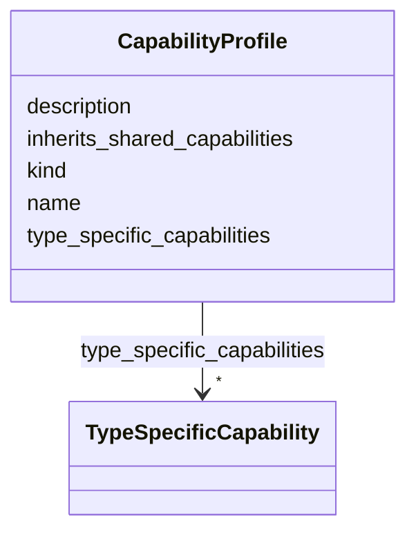

# Class: CapabilityProfile 


_A device-type profile that reuses shared capabilities and adds specific capabilities._


URI: [https://w3id.org/narad_linkml/schema/narad/schema/CapabilityProfile](https://w3id.org/narad_linkml/schema/narad/schema/CapabilityProfile)





<!-- no inheritance hierarchy -->


## Slots

| Name | Cardinality and Range | Description | Inheritance |
| ---  | --- | --- | --- |
| [name](name.md) | 1 <br/> [String](String.md) | Name/identifier of the entity | direct |
| [kind](kind.md) | 0..1 <br/> [String](String.md) | Kind/type of the profile family or profile instance | direct |
| [description](description.md) | 0..1 <br/> [String](String.md) |  | direct |
| [inherits_shared_capabilities](inherits_shared_capabilities.md) | * <br/> [String](String.md) | Names of shared capabilities inherited by the profile | direct |
| [type_specific_capabilities](type_specific_capabilities.md) | * <br/> [TypeSpecificCapability](TypeSpecificCapability.md) | Type-specific capabilities declared directly in a profile, each with an id, c... | direct |


## Usages

| used by | used in | type | used |
| ---  | --- | --- | --- |
| [ControlProfileFamily](ControlProfileFamily.md) | [magnet_type_profiles](magnet_type_profiles.md) | range | [CapabilityProfile](CapabilityProfile.md) |
| [ControlProfileFamily](ControlProfileFamily.md) | [instrument_type_profiles](instrument_type_profiles.md) | range | [CapabilityProfile](CapabilityProfile.md) |
| [ControlProfileFamily](ControlProfileFamily.md) | [cavity_type_profiles](cavity_type_profiles.md) | range | [CapabilityProfile](CapabilityProfile.md) |
| [ElementNaradRef](ElementNaradRef.md) | [capability_profile](capability_profile.md) | range | [CapabilityProfile](CapabilityProfile.md) |


## Identifier and Mapping Information


### Schema Source


* from schema: https://w3id.org/narad_linkml/schema/narad/schema


## Mappings

| Mapping Type | Mapped Value |
| ---  | ---  |
| self | https://w3id.org/narad_linkml/schema/narad/schema/CapabilityProfile |
| native | https://w3id.org/narad_linkml/schema/narad/schema/CapabilityProfile |


## LinkML Source

<!-- TODO: investigate https://stackoverflow.com/questions/37606292/how-to-create-tabbed-code-blocks-in-mkdocs-or-sphinx -->

### Direct

<details>
```yaml
name: CapabilityProfile
description: A device-type profile that reuses shared capabilities and adds specific
  capabilities.
from_schema: https://w3id.org/narad_linkml/schema/narad/schema
slots:
- name
- kind
- description
- inherits_shared_capabilities
- type_specific_capabilities

```
</details>

### Induced

<details>
```yaml
name: CapabilityProfile
description: A device-type profile that reuses shared capabilities and adds specific
  capabilities.
from_schema: https://w3id.org/narad_linkml/schema/narad/schema
attributes:
  name:
    name: name
    description: Name/identifier of the entity.
    from_schema: https://w3id.org/narad_linkml/schema/narad/schema
    rank: 1000
    identifier: true
    alias: name
    owner: CapabilityProfile
    domain_of:
    - Facility
    - SignalBinding
    - DeviceTypeSignalSet
    - Signal
    - Capability
    - CapabilityProfile
    - ControlProfileFamily
    - Beamline
    - BeamlineElement
    - PVBinding
    - KeyValuePair
    range: string
    required: true
  kind:
    name: kind
    description: Kind/type of the profile family or profile instance.
    from_schema: https://w3id.org/narad_linkml/schema/narad/schema
    aliases:
    - type
    - profile_type
    rank: 1000
    alias: kind
    owner: CapabilityProfile
    domain_of:
    - CapabilityProfile
    - ControlProfileFamily
    - Beamline
    - BeamlineElement
    range: string
  description:
    name: description
    from_schema: https://w3id.org/narad_linkml/schema/narad/schema
    rank: 1000
    alias: description
    owner: CapabilityProfile
    domain_of:
    - SignalBinding
    - Signal
    - Capability
    - TypeSpecificCapability
    - CapabilityProfile
    - ControlProfileFamily
    range: string
  inherits_shared_capabilities:
    name: inherits_shared_capabilities
    description: Names of shared capabilities inherited by the profile.
    from_schema: https://w3id.org/narad_linkml/schema/narad/schema
    rank: 1000
    alias: inherits_shared_capabilities
    owner: CapabilityProfile
    domain_of:
    - CapabilityProfile
    range: string
    multivalued: true
  type_specific_capabilities:
    name: type_specific_capabilities
    description: Type-specific capabilities declared directly in a profile, each with
      an id, class label, description, and signals.
    from_schema: https://w3id.org/narad_linkml/schema/narad/schema
    rank: 1000
    alias: type_specific_capabilities
    owner: CapabilityProfile
    domain_of:
    - CapabilityProfile
    - ElementSemantics
    range: TypeSpecificCapability
    multivalued: true
    inlined: true
    inlined_as_list: true

```
</details>