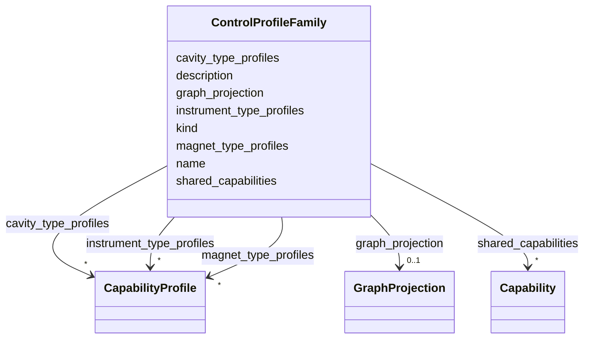

# Class: ControlProfileFamily 


_A reusable family of control profiles sharing common semantics and structure._


URI: [https://w3id.org/narad_linkml/schema/narad/schema/ControlProfileFamily](https://w3id.org/narad_linkml/schema/narad/schema/ControlProfileFamily)





<!-- no inheritance hierarchy -->


## Slots

| Name | Cardinality and Range | Description | Inheritance |
| ---  | --- | --- | --- |
| [name](name.md) | 1 <br/> [String](String.md) | Name/identifier of the entity | direct |
| [kind](kind.md) | 0..1 <br/> [String](String.md) | Kind/type of the profile family or profile instance | direct |
| [description](description.md) | 0..1 <br/> [String](String.md) |  | direct |
| [shared_capabilities](shared_capabilities.md) | * <br/> [Capability](Capability.md) | Named shared capabilities reused by profile types in a family | direct |
| [magnet_type_profiles](magnet_type_profiles.md) | * <br/> [CapabilityProfile](CapabilityProfile.md) | Magnet profile definitions keyed by profile name | direct |
| [instrument_type_profiles](instrument_type_profiles.md) | * <br/> [CapabilityProfile](CapabilityProfile.md) | Instrument profile definitions keyed by profile name | direct |
| [cavity_type_profiles](cavity_type_profiles.md) | * <br/> [CapabilityProfile](CapabilityProfile.md) | RF cavity profile definitions keyed by profile name | direct |
| [graph_projection](graph_projection.md) | 0..1 <br/> [GraphProjection](GraphProjection.md) | Optional graph projection metadata attached to a profile family | direct |


## Usages

| used by | used in | type | used |
| ---  | --- | --- | --- |
| [CapabilityLayer](CapabilityLayer.md) | [profiles](profiles.md) | range | [ControlProfileFamily](ControlProfileFamily.md) |
| [ElementNaradRef](ElementNaradRef.md) | [capability_profile_family](capability_profile_family.md) | range | [ControlProfileFamily](ControlProfileFamily.md) |


## Aliases


* capability_profile_family
* control_profile_family


## Identifier and Mapping Information


### Schema Source


* from schema: https://w3id.org/narad_linkml/schema/narad/schema


## Mappings

| Mapping Type | Mapped Value |
| ---  | ---  |
| self | https://w3id.org/narad_linkml/schema/narad/schema/ControlProfileFamily |
| native | https://w3id.org/narad_linkml/schema/narad/schema/ControlProfileFamily |


## LinkML Source

<!-- TODO: investigate https://stackoverflow.com/questions/37606292/how-to-create-tabbed-code-blocks-in-mkdocs-or-sphinx -->

### Direct

<details>
```yaml
name: ControlProfileFamily
description: A reusable family of control profiles sharing common semantics and structure.
from_schema: https://w3id.org/narad_linkml/schema/narad/schema
aliases:
- capability_profile_family
- control_profile_family
slots:
- name
- kind
- description
- shared_capabilities
- magnet_type_profiles
- instrument_type_profiles
- cavity_type_profiles
- graph_projection

```
</details>

### Induced

<details>
```yaml
name: ControlProfileFamily
description: A reusable family of control profiles sharing common semantics and structure.
from_schema: https://w3id.org/narad_linkml/schema/narad/schema
aliases:
- capability_profile_family
- control_profile_family
attributes:
  name:
    name: name
    description: Name/identifier of the entity.
    from_schema: https://w3id.org/narad_linkml/schema/narad/schema
    rank: 1000
    identifier: true
    alias: name
    owner: ControlProfileFamily
    domain_of:
    - Facility
    - SignalBinding
    - DeviceTypeSignalSet
    - Signal
    - Capability
    - CapabilityProfile
    - ControlProfileFamily
    - Beamline
    - BeamlineElement
    - PVBinding
    - KeyValuePair
    range: string
    required: true
  kind:
    name: kind
    description: Kind/type of the profile family or profile instance.
    from_schema: https://w3id.org/narad_linkml/schema/narad/schema
    aliases:
    - type
    - profile_type
    rank: 1000
    alias: kind
    owner: ControlProfileFamily
    domain_of:
    - CapabilityProfile
    - ControlProfileFamily
    - Beamline
    - BeamlineElement
    range: string
  description:
    name: description
    from_schema: https://w3id.org/narad_linkml/schema/narad/schema
    rank: 1000
    alias: description
    owner: ControlProfileFamily
    domain_of:
    - SignalBinding
    - Signal
    - Capability
    - TypeSpecificCapability
    - CapabilityProfile
    - ControlProfileFamily
    range: string
  shared_capabilities:
    name: shared_capabilities
    description: Named shared capabilities reused by profile types in a family.
    from_schema: https://w3id.org/narad_linkml/schema/narad/schema
    rank: 1000
    alias: shared_capabilities
    owner: ControlProfileFamily
    domain_of:
    - ControlProfileFamily
    - ElementSemantics
    range: Capability
    multivalued: true
    inlined: true
  magnet_type_profiles:
    name: magnet_type_profiles
    description: Magnet profile definitions keyed by profile name.
    from_schema: https://w3id.org/narad_linkml/schema/narad/schema
    rank: 1000
    alias: magnet_type_profiles
    owner: ControlProfileFamily
    domain_of:
    - ControlProfileFamily
    range: CapabilityProfile
    multivalued: true
    inlined: true
  instrument_type_profiles:
    name: instrument_type_profiles
    description: Instrument profile definitions keyed by profile name.
    from_schema: https://w3id.org/narad_linkml/schema/narad/schema
    rank: 1000
    alias: instrument_type_profiles
    owner: ControlProfileFamily
    domain_of:
    - ControlProfileFamily
    range: CapabilityProfile
    multivalued: true
    inlined: true
  cavity_type_profiles:
    name: cavity_type_profiles
    description: RF cavity profile definitions keyed by profile name.
    from_schema: https://w3id.org/narad_linkml/schema/narad/schema
    rank: 1000
    alias: cavity_type_profiles
    owner: ControlProfileFamily
    domain_of:
    - ControlProfileFamily
    range: CapabilityProfile
    multivalued: true
    inlined: true
  graph_projection:
    name: graph_projection
    description: Optional graph projection metadata attached to a profile family.
    from_schema: https://w3id.org/narad_linkml/schema/narad/schema
    rank: 1000
    alias: graph_projection
    owner: ControlProfileFamily
    domain_of:
    - ControlProfileFamily
    range: GraphProjection
    inlined: true

```
</details>