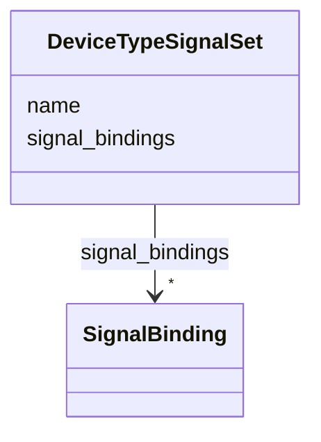

# Class: DeviceTypeSignalSet 


_Signal binding set scoped to a device type (for example, Quadrupole or BPM)._


URI: [https://w3id.org/narad_linkml/schema/narad/schema/DeviceTypeSignalSet](https://w3id.org/narad_linkml/schema/narad/schema/DeviceTypeSignalSet)





<!-- no inheritance hierarchy -->


## Slots

| Name | Cardinality and Range | Description | Inheritance |
| ---  | --- | --- | --- |
| [name](name.md) | 1 <br/> [String](String.md) | Name/identifier of the entity | direct |
| [signal_bindings](signal_bindings.md) | * <br/> [SignalBinding](SignalBinding.md) | Signal definitions keyed by signal name within a device type | direct |


## Usages

| used by | used in | type | used |
| ---  | --- | --- | --- |
| [SignalDefinitions](SignalDefinitions.md) | [magnet_type_signals](magnet_type_signals.md) | range | [DeviceTypeSignalSet](DeviceTypeSignalSet.md) |
| [SignalDefinitions](SignalDefinitions.md) | [instrument_type_signals](instrument_type_signals.md) | range | [DeviceTypeSignalSet](DeviceTypeSignalSet.md) |


## Identifier and Mapping Information


### Schema Source


* from schema: https://w3id.org/narad_linkml/schema/narad/schema


## Mappings

| Mapping Type | Mapped Value |
| ---  | ---  |
| self | https://w3id.org/narad_linkml/schema/narad/schema/DeviceTypeSignalSet |
| native | https://w3id.org/narad_linkml/schema/narad/schema/DeviceTypeSignalSet |


## LinkML Source

<!-- TODO: investigate https://stackoverflow.com/questions/37606292/how-to-create-tabbed-code-blocks-in-mkdocs-or-sphinx -->

### Direct

<details>
```yaml
name: DeviceTypeSignalSet
description: Signal binding set scoped to a device type (for example, Quadrupole or
  BPM).
from_schema: https://w3id.org/narad_linkml/schema/narad/schema
slots:
- name
- signal_bindings

```
</details>

### Induced

<details>
```yaml
name: DeviceTypeSignalSet
description: Signal binding set scoped to a device type (for example, Quadrupole or
  BPM).
from_schema: https://w3id.org/narad_linkml/schema/narad/schema
attributes:
  name:
    name: name
    description: Name/identifier of the entity.
    from_schema: https://w3id.org/narad_linkml/schema/narad/schema
    rank: 1000
    identifier: true
    alias: name
    owner: DeviceTypeSignalSet
    domain_of:
    - Facility
    - SignalBinding
    - DeviceTypeSignalSet
    - Signal
    - Capability
    - CapabilityProfile
    - ControlProfileFamily
    - Beamline
    - BeamlineElement
    - PVBinding
    - KeyValuePair
    range: string
    required: true
  signal_bindings:
    name: signal_bindings
    description: Signal definitions keyed by signal name within a device type.
    from_schema: https://w3id.org/narad_linkml/schema/narad/schema
    rank: 1000
    alias: signal_bindings
    owner: DeviceTypeSignalSet
    domain_of:
    - DeviceTypeSignalSet
    - ElementNaradRef
    range: SignalBinding
    multivalued: true
    inlined: true

```
</details>