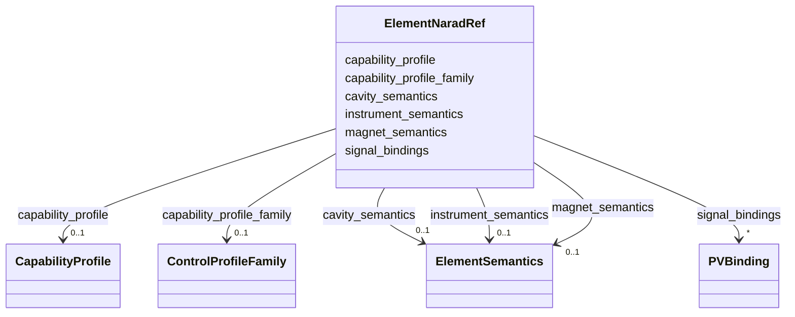

# Class: ElementNaradRef 


_NARAD semantic reference block attached to a beamline element._


URI: [https://w3id.org/narad_linkml/schema/narad/schema/ElementNaradRef](https://w3id.org/narad_linkml/schema/narad/schema/ElementNaradRef)





<!-- no inheritance hierarchy -->


## Slots

| Name | Cardinality and Range | Description | Inheritance |
| ---  | --- | --- | --- |
| [capability_profile_family](capability_profile_family.md) | 0..1 <br/> [ControlProfileFamily](ControlProfileFamily.md) | Cross-reference to the control profile family for this element | direct |
| [capability_profile](capability_profile.md) | 0..1 <br/> [CapabilityProfile](CapabilityProfile.md) | Cross-reference to the specific capability profile applied to this element | direct |
| [magnet_semantics](magnet_semantics.md) | 0..1 <br/> [ElementSemantics](ElementSemantics.md) | Magnet-domain semantic context for this element | direct |
| [instrument_semantics](instrument_semantics.md) | 0..1 <br/> [ElementSemantics](ElementSemantics.md) | Instrument-domain semantic context for this element | direct |
| [cavity_semantics](cavity_semantics.md) | 0..1 <br/> [ElementSemantics](ElementSemantics.md) | RF-cavity-domain semantic context for this element | direct |
| [signal_bindings](signal_bindings.md) | * <br/> [PVBinding](PVBinding.md) | Signal definitions keyed by signal name within a device type | direct |


## Usages

| used by | used in | type | used |
| ---  | --- | --- | --- |
| [BeamlineElement](BeamlineElement.md) | [narad](narad.md) | range | [ElementNaradRef](ElementNaradRef.md) |


## Identifier and Mapping Information


### Schema Source


* from schema: https://w3id.org/narad_linkml/schema/narad/schema


## Mappings

| Mapping Type | Mapped Value |
| ---  | ---  |
| self | https://w3id.org/narad_linkml/schema/narad/schema/ElementNaradRef |
| native | https://w3id.org/narad_linkml/schema/narad/schema/ElementNaradRef |


## LinkML Source

<!-- TODO: investigate https://stackoverflow.com/questions/37606292/how-to-create-tabbed-code-blocks-in-mkdocs-or-sphinx -->

### Direct

<details>
```yaml
name: ElementNaradRef
description: NARAD semantic reference block attached to a beamline element.
from_schema: https://w3id.org/narad_linkml/schema/narad/schema
slots:
- capability_profile_family
- capability_profile
- magnet_semantics
- instrument_semantics
- cavity_semantics
- signal_bindings
slot_usage:
  signal_bindings:
    name: signal_bindings
    range: PVBinding

```
</details>

### Induced

<details>
```yaml
name: ElementNaradRef
description: NARAD semantic reference block attached to a beamline element.
from_schema: https://w3id.org/narad_linkml/schema/narad/schema
slot_usage:
  signal_bindings:
    name: signal_bindings
    range: PVBinding
attributes:
  capability_profile_family:
    name: capability_profile_family
    description: Cross-reference to the control profile family for this element.
    from_schema: https://w3id.org/narad_linkml/schema/narad/schema
    rank: 1000
    alias: capability_profile_family
    owner: ElementNaradRef
    domain_of:
    - ElementNaradRef
    range: ControlProfileFamily
    inlined: false
  capability_profile:
    name: capability_profile
    description: Cross-reference to the specific capability profile applied to this
      element.
    from_schema: https://w3id.org/narad_linkml/schema/narad/schema
    rank: 1000
    alias: capability_profile
    owner: ElementNaradRef
    domain_of:
    - ElementNaradRef
    range: CapabilityProfile
    inlined: false
  magnet_semantics:
    name: magnet_semantics
    description: Magnet-domain semantic context for this element.
    from_schema: https://w3id.org/narad_linkml/schema/narad/schema
    rank: 1000
    alias: magnet_semantics
    owner: ElementNaradRef
    domain_of:
    - ElementNaradRef
    range: ElementSemantics
    inlined: true
  instrument_semantics:
    name: instrument_semantics
    description: Instrument-domain semantic context for this element.
    from_schema: https://w3id.org/narad_linkml/schema/narad/schema
    rank: 1000
    alias: instrument_semantics
    owner: ElementNaradRef
    domain_of:
    - ElementNaradRef
    range: ElementSemantics
    inlined: true
  cavity_semantics:
    name: cavity_semantics
    description: RF-cavity-domain semantic context for this element.
    from_schema: https://w3id.org/narad_linkml/schema/narad/schema
    rank: 1000
    alias: cavity_semantics
    owner: ElementNaradRef
    domain_of:
    - ElementNaradRef
    range: ElementSemantics
    inlined: true
  signal_bindings:
    name: signal_bindings
    description: Signal definitions keyed by signal name within a device type.
    from_schema: https://w3id.org/narad_linkml/schema/narad/schema
    rank: 1000
    alias: signal_bindings
    owner: ElementNaradRef
    domain_of:
    - DeviceTypeSignalSet
    - ElementNaradRef
    range: PVBinding
    multivalued: true
    inlined: true

```
</details>