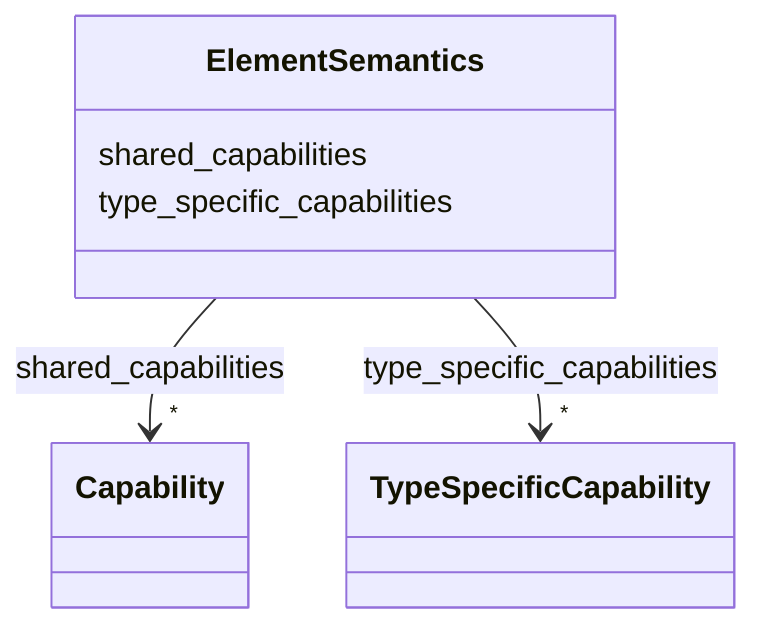

# Class: ElementSemantics 


_Semantic context referencing shared and type-specific capability names for a beamline element._


URI: [https://w3id.org/narad_linkml/schema/narad/schema/ElementSemantics](https://w3id.org/narad_linkml/schema/narad/schema/ElementSemantics)





<!-- no inheritance hierarchy -->


## Slots

| Name | Cardinality and Range | Description | Inheritance |
| ---  | --- | --- | --- |
| [shared_capabilities](shared_capabilities.md) | * <br/> [Capability](Capability.md) | Names of shared capabilities applied to this element, referencing Capability ... | direct |
| [type_specific_capabilities](type_specific_capabilities.md) | * <br/> [TypeSpecificCapability](TypeSpecificCapability.md) | Capability class labels (e | direct |


## Usages

| used by | used in | type | used |
| ---  | --- | --- | --- |
| [ElementNaradRef](ElementNaradRef.md) | [magnet_semantics](magnet_semantics.md) | range | [ElementSemantics](ElementSemantics.md) |
| [ElementNaradRef](ElementNaradRef.md) | [instrument_semantics](instrument_semantics.md) | range | [ElementSemantics](ElementSemantics.md) |
| [ElementNaradRef](ElementNaradRef.md) | [cavity_semantics](cavity_semantics.md) | range | [ElementSemantics](ElementSemantics.md) |


## Identifier and Mapping Information


### Schema Source


* from schema: https://w3id.org/narad_linkml/schema/narad/schema


## Mappings

| Mapping Type | Mapped Value |
| ---  | ---  |
| self | https://w3id.org/narad_linkml/schema/narad/schema/ElementSemantics |
| native | https://w3id.org/narad_linkml/schema/narad/schema/ElementSemantics |


## LinkML Source

<!-- TODO: investigate https://stackoverflow.com/questions/37606292/how-to-create-tabbed-code-blocks-in-mkdocs-or-sphinx -->

### Direct

<details>
```yaml
name: ElementSemantics
description: Semantic context referencing shared and type-specific capability names
  for a beamline element.
from_schema: https://w3id.org/narad_linkml/schema/narad/schema
attributes:
  shared_capabilities:
    name: shared_capabilities
    description: Names of shared capabilities applied to this element, referencing
      Capability by name.
    from_schema: https://w3id.org/narad_linkml/schema/narad/schema
    domain_of:
    - ControlProfileFamily
    - ElementSemantics
    range: Capability
    multivalued: true
    inlined: false
  type_specific_capabilities:
    name: type_specific_capabilities
    description: Capability class labels (e.g. CorrectorKickCapability) identifying
      which type-specific capabilities apply to this element. These match the capability_class
      field of TypeSpecificCapability entries in the profile.
    from_schema: https://w3id.org/narad_linkml/schema/narad/schema
    domain_of:
    - CapabilityProfile
    - ElementSemantics
    range: TypeSpecificCapability
    multivalued: true

```
</details>

### Induced

<details>
```yaml
name: ElementSemantics
description: Semantic context referencing shared and type-specific capability names
  for a beamline element.
from_schema: https://w3id.org/narad_linkml/schema/narad/schema
attributes:
  shared_capabilities:
    name: shared_capabilities
    description: Names of shared capabilities applied to this element, referencing
      Capability by name.
    from_schema: https://w3id.org/narad_linkml/schema/narad/schema
    alias: shared_capabilities
    owner: ElementSemantics
    domain_of:
    - ControlProfileFamily
    - ElementSemantics
    range: Capability
    multivalued: true
    inlined: false
  type_specific_capabilities:
    name: type_specific_capabilities
    description: Capability class labels (e.g. CorrectorKickCapability) identifying
      which type-specific capabilities apply to this element. These match the capability_class
      field of TypeSpecificCapability entries in the profile.
    from_schema: https://w3id.org/narad_linkml/schema/narad/schema
    alias: type_specific_capabilities
    owner: ElementSemantics
    domain_of:
    - CapabilityProfile
    - ElementSemantics
    range: TypeSpecificCapability
    multivalued: true

```
</details>