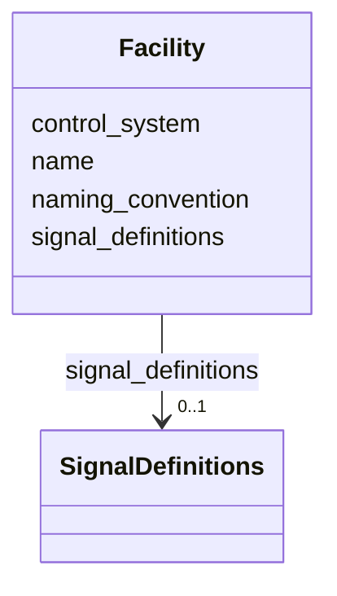

# Class: Facility 


_A facility with specific signal bindings._


URI: [https://w3id.org/narad_linkml/schema/narad/schema/Facility](https://w3id.org/narad_linkml/schema/narad/schema/Facility)





<!-- no inheritance hierarchy -->


## Slots

| Name | Cardinality and Range | Description | Inheritance |
| ---  | --- | --- | --- |
| [name](name.md) | 1 <br/> [String](String.md) | Name/identifier of the entity | direct |
| [control_system](control_system.md) | 0..1 <br/> [String](String.md) |  | direct |
| [naming_convention](naming_convention.md) | 0..1 <br/> [String](String.md) |  | direct |
| [signal_definitions](signal_definitions.md) | 0..1 <br/> [SignalDefinitions](SignalDefinitions.md) |  | direct |


## Usages

| used by | used in | type | used |
| ---  | --- | --- | --- |
| [SignalLayer](SignalLayer.md) | [facilities](facilities.md) | range | [Facility](Facility.md) |


## Identifier and Mapping Information


### Schema Source


* from schema: https://w3id.org/narad_linkml/schema/narad/schema


## Mappings

| Mapping Type | Mapped Value |
| ---  | ---  |
| self | https://w3id.org/narad_linkml/schema/narad/schema/Facility |
| native | https://w3id.org/narad_linkml/schema/narad/schema/Facility |


## LinkML Source

<!-- TODO: investigate https://stackoverflow.com/questions/37606292/how-to-create-tabbed-code-blocks-in-mkdocs-or-sphinx -->

### Direct

<details>
```yaml
name: Facility
description: A facility with specific signal bindings.
from_schema: https://w3id.org/narad_linkml/schema/narad/schema
slots:
- name
- control_system
- naming_convention
- signal_definitions

```
</details>

### Induced

<details>
```yaml
name: Facility
description: A facility with specific signal bindings.
from_schema: https://w3id.org/narad_linkml/schema/narad/schema
attributes:
  name:
    name: name
    description: Name/identifier of the entity.
    from_schema: https://w3id.org/narad_linkml/schema/narad/schema
    rank: 1000
    identifier: true
    alias: name
    owner: Facility
    domain_of:
    - Facility
    - SignalBinding
    - DeviceTypeSignalSet
    - Signal
    - Capability
    - CapabilityProfile
    - ControlProfileFamily
    - Beamline
    - BeamlineElement
    - PVBinding
    - KeyValuePair
    range: string
    required: true
  control_system:
    name: control_system
    from_schema: https://w3id.org/narad_linkml/schema/narad/schema
    rank: 1000
    alias: control_system
    owner: Facility
    domain_of:
    - NaradConfig
    - Facility
    - PVBinding
    range: string
  naming_convention:
    name: naming_convention
    from_schema: https://w3id.org/narad_linkml/schema/narad/schema
    rank: 1000
    alias: naming_convention
    owner: Facility
    domain_of:
    - Facility
    range: string
  signal_definitions:
    name: signal_definitions
    from_schema: https://w3id.org/narad_linkml/schema/narad/schema
    rank: 1000
    alias: signal_definitions
    owner: Facility
    domain_of:
    - Facility
    range: SignalDefinitions
    inlined: true

```
</details>