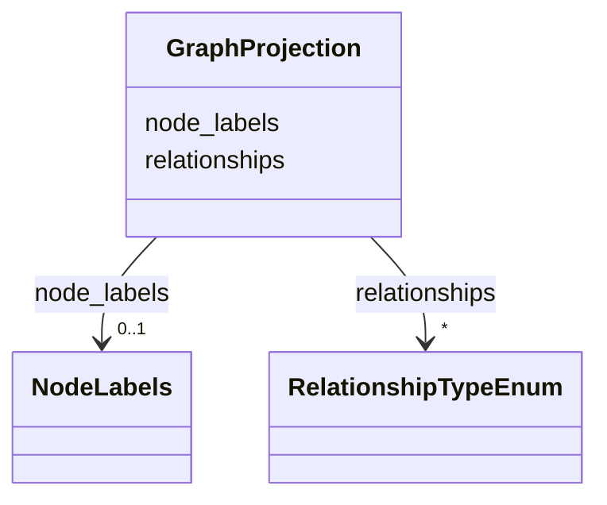

# Class: GraphProjection 


_Graph projection metadata for node labels and edge categories._


URI: [https://w3id.org/narad_linkml/schema/narad/schema/GraphProjection](https://w3id.org/narad_linkml/schema/narad/schema/GraphProjection)





<!-- no inheritance hierarchy -->


## Slots

| Name | Cardinality and Range | Description | Inheritance |
| ---  | --- | --- | --- |
| [node_labels](node_labels.md) | 0..1 <br/> [NodeLabels](NodeLabels.md) | Node label mapping for the graph projection | direct |
| [relationships](relationships.md) | * <br/> [RelationshipTypeEnum](RelationshipTypeEnum.md) | Relationship labels used in graph projection | direct |


## Usages

| used by | used in | type | used |
| ---  | --- | --- | --- |
| [ControlProfileFamily](ControlProfileFamily.md) | [graph_projection](graph_projection.md) | range | [GraphProjection](GraphProjection.md) |


## Identifier and Mapping Information


### Schema Source


* from schema: https://w3id.org/narad_linkml/schema/narad/schema


## Mappings

| Mapping Type | Mapped Value |
| ---  | ---  |
| self | https://w3id.org/narad_linkml/schema/narad/schema/GraphProjection |
| native | https://w3id.org/narad_linkml/schema/narad/schema/GraphProjection |


## LinkML Source

<!-- TODO: investigate https://stackoverflow.com/questions/37606292/how-to-create-tabbed-code-blocks-in-mkdocs-or-sphinx -->

### Direct

<details>
```yaml
name: GraphProjection
description: Graph projection metadata for node labels and edge categories.
from_schema: https://w3id.org/narad_linkml/schema/narad/schema
slots:
- node_labels
- relationships

```
</details>

### Induced

<details>
```yaml
name: GraphProjection
description: Graph projection metadata for node labels and edge categories.
from_schema: https://w3id.org/narad_linkml/schema/narad/schema
attributes:
  node_labels:
    name: node_labels
    description: Node label mapping for the graph projection.
    from_schema: https://w3id.org/narad_linkml/schema/narad/schema
    rank: 1000
    alias: node_labels
    owner: GraphProjection
    domain_of:
    - GraphProjection
    range: NodeLabels
    inlined: true
  relationships:
    name: relationships
    description: Relationship labels used in graph projection.
    from_schema: https://w3id.org/narad_linkml/schema/narad/schema
    rank: 1000
    alias: relationships
    owner: GraphProjection
    domain_of:
    - GraphProjection
    range: RelationshipTypeEnum
    multivalued: true

```
</details>