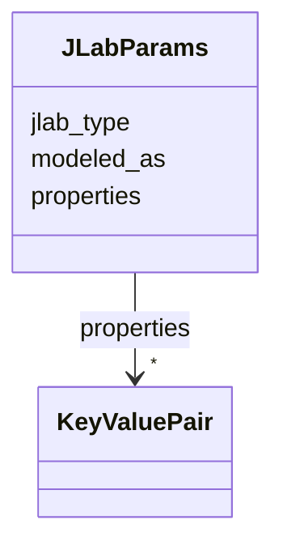

# Class: JLabParams 


_JLab-specific element parameters: type designation, accelerator model name, and open property map._


URI: [https://w3id.org/narad_linkml/schema/narad/schema/JLabParams](https://w3id.org/narad_linkml/schema/narad/schema/JLabParams)





<!-- no inheritance hierarchy -->


## Slots

| Name | Cardinality and Range | Description | Inheritance |
| ---  | --- | --- | --- |
| [jlab_type](jlab_type.md) | 0..1 <br/> [String](String.md) | JLab-specific element type designation (e | direct |
| [modeled_as](modeled_as.md) | 0..1 <br/> [String](String.md) | Accelerator physics code model element type (e | direct |
| [properties](properties.md) | * <br/> [KeyValuePair](KeyValuePair.md) | Open-ended key-value property map for element-specific parameters | direct |


## Usages

| used by | used in | type | used |
| ---  | --- | --- | --- |
| [BeamlineElement](BeamlineElement.md) | [JLabP](JLabP.md) | range | [JLabParams](JLabParams.md) |


## Identifier and Mapping Information


### Schema Source


* from schema: https://w3id.org/narad_linkml/schema/narad/schema


## Mappings

| Mapping Type | Mapped Value |
| ---  | ---  |
| self | https://w3id.org/narad_linkml/schema/narad/schema/JLabParams |
| native | https://w3id.org/narad_linkml/schema/narad/schema/JLabParams |


## LinkML Source

<!-- TODO: investigate https://stackoverflow.com/questions/37606292/how-to-create-tabbed-code-blocks-in-mkdocs-or-sphinx -->

### Direct

<details>
```yaml
name: JLabParams
description: 'JLab-specific element parameters: type designation, accelerator model
  name, and open property map.'
from_schema: https://w3id.org/narad_linkml/schema/narad/schema
slots:
- jlab_type
- modeled_as
- properties

```
</details>

### Induced

<details>
```yaml
name: JLabParams
description: 'JLab-specific element parameters: type designation, accelerator model
  name, and open property map.'
from_schema: https://w3id.org/narad_linkml/schema/narad/schema
attributes:
  jlab_type:
    name: jlab_type
    description: JLab-specific element type designation (e.g. WarmCavity, QW, HCorrector).
      Serialized as 'type' in source YAML; renamed here to avoid conflict with the
      LinkML metamodel 'type' designator used for polymorphic class selection.
    from_schema: https://w3id.org/narad_linkml/schema/narad/schema
    aliases:
    - type
    rank: 1000
    alias: jlab_type
    owner: JLabParams
    domain_of:
    - JLabParams
    range: string
  modeled_as:
    name: modeled_as
    description: Accelerator physics code model element type (e.g. RFCA, KQUAD, HKICK).
    from_schema: https://w3id.org/narad_linkml/schema/narad/schema
    rank: 1000
    alias: modeled_as
    owner: JLabParams
    domain_of:
    - JLabParams
    range: string
  properties:
    name: properties
    description: Open-ended key-value property map for element-specific parameters.
    from_schema: https://w3id.org/narad_linkml/schema/narad/schema
    rank: 1000
    alias: properties
    owner: JLabParams
    domain_of:
    - JLabParams
    range: KeyValuePair
    multivalued: true
    inlined: true

```
</details>