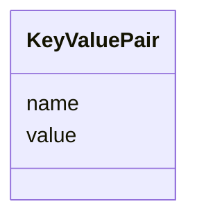

# Class: KeyValuePair 


_A generic key-value pair for open-ended property maps._


URI: [https://w3id.org/narad_linkml/schema/narad/schema/KeyValuePair](https://w3id.org/narad_linkml/schema/narad/schema/KeyValuePair)





<!-- no inheritance hierarchy -->


## Slots

| Name | Cardinality and Range | Description | Inheritance |
| ---  | --- | --- | --- |
| [name](name.md) | 1 <br/> [String](String.md) | Name/identifier of the entity | direct |
| [value](value.md) | 0..1 <br/> [String](String.md) | Property value as a string | direct |


## Usages

| used by | used in | type | used |
| ---  | --- | --- | --- |
| [JLabParams](JLabParams.md) | [properties](properties.md) | range | [KeyValuePair](KeyValuePair.md) |


## Identifier and Mapping Information


### Schema Source


* from schema: https://w3id.org/narad_linkml/schema/narad/schema


## Mappings

| Mapping Type | Mapped Value |
| ---  | ---  |
| self | https://w3id.org/narad_linkml/schema/narad/schema/KeyValuePair |
| native | https://w3id.org/narad_linkml/schema/narad/schema/KeyValuePair |


## LinkML Source

<!-- TODO: investigate https://stackoverflow.com/questions/37606292/how-to-create-tabbed-code-blocks-in-mkdocs-or-sphinx -->

### Direct

<details>
```yaml
name: KeyValuePair
description: A generic key-value pair for open-ended property maps.
from_schema: https://w3id.org/narad_linkml/schema/narad/schema
slots:
- name
- value

```
</details>

### Induced

<details>
```yaml
name: KeyValuePair
description: A generic key-value pair for open-ended property maps.
from_schema: https://w3id.org/narad_linkml/schema/narad/schema
attributes:
  name:
    name: name
    description: Name/identifier of the entity.
    from_schema: https://w3id.org/narad_linkml/schema/narad/schema
    rank: 1000
    identifier: true
    alias: name
    owner: KeyValuePair
    domain_of:
    - Facility
    - SignalBinding
    - DeviceTypeSignalSet
    - Signal
    - Capability
    - CapabilityProfile
    - ControlProfileFamily
    - Beamline
    - BeamlineElement
    - PVBinding
    - KeyValuePair
    range: string
    required: true
  value:
    name: value
    description: Property value as a string.
    from_schema: https://w3id.org/narad_linkml/schema/narad/schema
    rank: 1000
    alias: value
    owner: KeyValuePair
    domain_of:
    - KeyValuePair
    range: string

```
</details>