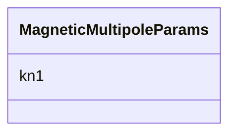

# Class: MagneticMultipoleParams 


_Magnetic multipole physics parameters._


URI: [https://w3id.org/narad_linkml/schema/narad/schema/MagneticMultipoleParams](https://w3id.org/narad_linkml/schema/narad/schema/MagneticMultipoleParams)





<!-- no inheritance hierarchy -->


## Slots

| Name | Cardinality and Range | Description | Inheritance |
| ---  | --- | --- | --- |
| [kn1](kn1.md) | 0..1 <br/> [Float](Float.md) | First-order magnetic multipole coefficient (quadrupole strength) | direct |


## Usages

| used by | used in | type | used |
| ---  | --- | --- | --- |
| [BeamlineElement](BeamlineElement.md) | [MagneticMultipoleP](MagneticMultipoleP.md) | range | [MagneticMultipoleParams](MagneticMultipoleParams.md) |


## Identifier and Mapping Information


### Schema Source


* from schema: https://w3id.org/narad_linkml/schema/narad/schema


## Mappings

| Mapping Type | Mapped Value |
| ---  | ---  |
| self | https://w3id.org/narad_linkml/schema/narad/schema/MagneticMultipoleParams |
| native | https://w3id.org/narad_linkml/schema/narad/schema/MagneticMultipoleParams |


## LinkML Source

<!-- TODO: investigate https://stackoverflow.com/questions/37606292/how-to-create-tabbed-code-blocks-in-mkdocs-or-sphinx -->

### Direct

<details>
```yaml
name: MagneticMultipoleParams
description: Magnetic multipole physics parameters.
from_schema: https://w3id.org/narad_linkml/schema/narad/schema
slots:
- kn1

```
</details>

### Induced

<details>
```yaml
name: MagneticMultipoleParams
description: Magnetic multipole physics parameters.
from_schema: https://w3id.org/narad_linkml/schema/narad/schema
attributes:
  kn1:
    name: kn1
    description: First-order magnetic multipole coefficient (quadrupole strength).
    from_schema: https://w3id.org/narad_linkml/schema/narad/schema
    rank: 1000
    alias: kn1
    owner: MagneticMultipoleParams
    domain_of:
    - MagneticMultipoleParams
    range: float

```
</details>