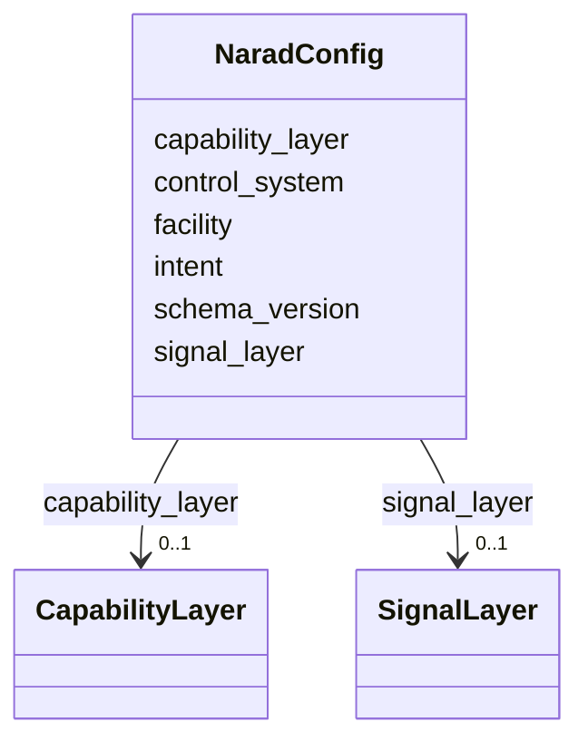

# Class: NaradConfig 


_NARAD configuration block containing the capability layer._


URI: [https://w3id.org/narad_linkml/schema/narad/schema/NaradConfig](https://w3id.org/narad_linkml/schema/narad/schema/NaradConfig)





<!-- no inheritance hierarchy -->


## Slots

| Name | Cardinality and Range | Description | Inheritance |
| ---  | --- | --- | --- |
| [schema_version](schema_version.md) | 0..1 <br/> [String](String.md) |  | direct |
| [intent](intent.md) | 0..1 <br/> [String](String.md) |  | direct |
| [capability_layer](capability_layer.md) | 0..1 <br/> [CapabilityLayer](CapabilityLayer.md) |  | direct |
| [facility](facility.md) | 0..1 <br/> [String](String.md) |  | direct |
| [control_system](control_system.md) | 0..1 <br/> [String](String.md) |  | direct |
| [signal_layer](signal_layer.md) | 0..1 <br/> [SignalLayer](SignalLayer.md) | Signal-layer container for facility-specific signal bindings | direct |


## Usages

| used by | used in | type | used |
| ---  | --- | --- | --- |
| [NaradModel](NaradModel.md) | [narad](narad.md) | range | [NaradConfig](NaradConfig.md) |


## Identifier and Mapping Information


### Schema Source


* from schema: https://w3id.org/narad_linkml/schema/narad/schema


## Mappings

| Mapping Type | Mapped Value |
| ---  | ---  |
| self | https://w3id.org/narad_linkml/schema/narad/schema/NaradConfig |
| native | https://w3id.org/narad_linkml/schema/narad/schema/NaradConfig |


## LinkML Source

<!-- TODO: investigate https://stackoverflow.com/questions/37606292/how-to-create-tabbed-code-blocks-in-mkdocs-or-sphinx -->

### Direct

<details>
```yaml
name: NaradConfig
description: NARAD configuration block containing the capability layer.
from_schema: https://w3id.org/narad_linkml/schema/narad/schema
slots:
- schema_version
- intent
- capability_layer
- facility
- control_system
- signal_layer

```
</details>

### Induced

<details>
```yaml
name: NaradConfig
description: NARAD configuration block containing the capability layer.
from_schema: https://w3id.org/narad_linkml/schema/narad/schema
attributes:
  schema_version:
    name: schema_version
    from_schema: https://w3id.org/narad_linkml/schema/narad/schema
    rank: 1000
    alias: schema_version
    owner: NaradConfig
    domain_of:
    - NaradConfig
    range: string
  intent:
    name: intent
    from_schema: https://w3id.org/narad_linkml/schema/narad/schema
    rank: 1000
    alias: intent
    owner: NaradConfig
    domain_of:
    - NaradConfig
    range: string
  capability_layer:
    name: capability_layer
    from_schema: https://w3id.org/narad_linkml/schema/narad/schema
    rank: 1000
    alias: capability_layer
    owner: NaradConfig
    domain_of:
    - NaradConfig
    range: CapabilityLayer
    inlined: true
  facility:
    name: facility
    from_schema: https://w3id.org/narad_linkml/schema/narad/schema
    rank: 1000
    alias: facility
    owner: NaradConfig
    domain_of:
    - NaradConfig
    - PVBinding
    range: string
  control_system:
    name: control_system
    from_schema: https://w3id.org/narad_linkml/schema/narad/schema
    rank: 1000
    alias: control_system
    owner: NaradConfig
    domain_of:
    - NaradConfig
    - Facility
    - PVBinding
    range: string
  signal_layer:
    name: signal_layer
    description: Signal-layer container for facility-specific signal bindings.
    from_schema: https://w3id.org/narad_linkml/schema/narad/schema
    rank: 1000
    alias: signal_layer
    owner: NaradConfig
    domain_of:
    - NaradConfig
    range: SignalLayer
    inlined: true

```
</details>