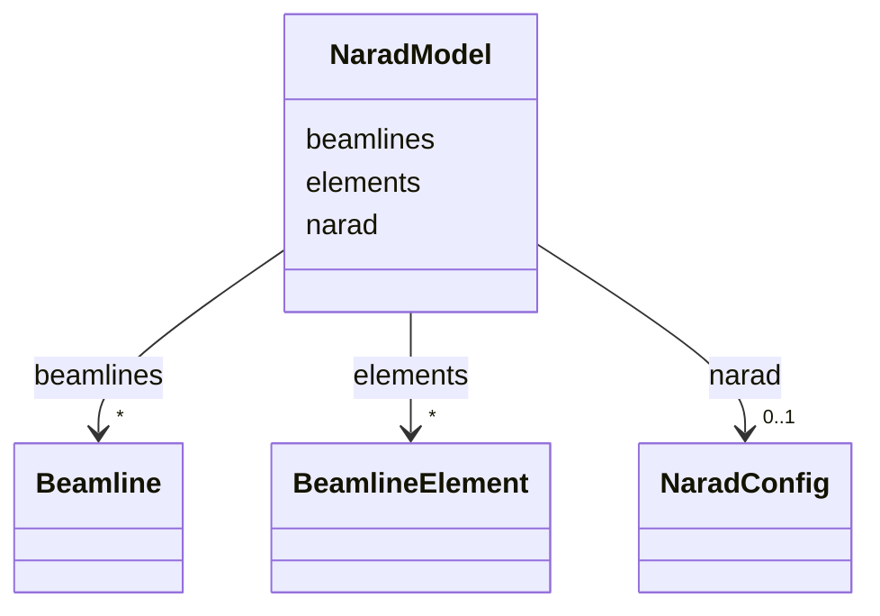

# Class: NaradModel 


_Top-level NARAD document container._


URI: [https://w3id.org/narad_linkml/schema/narad/schema/NaradModel](https://w3id.org/narad_linkml/schema/narad/schema/NaradModel)





<!-- no inheritance hierarchy -->


## Slots

| Name | Cardinality and Range | Description | Inheritance |
| ---  | --- | --- | --- |
| [narad](narad.md) | 0..1 <br/> [NaradConfig](NaradConfig.md) |  | direct |
| [beamlines](beamlines.md) | * <br/> [Beamline](Beamline.md) | Ordered list of beamlines in this NARAD document | direct |
| [elements](elements.md) | * <br/> [BeamlineElement](BeamlineElement.md) | Beamline element definitions (referenced by name from beamline line sequences... | direct |


## Identifier and Mapping Information


### Schema Source


* from schema: https://w3id.org/narad_linkml/schema/narad/schema


## Mappings

| Mapping Type | Mapped Value |
| ---  | ---  |
| self | https://w3id.org/narad_linkml/schema/narad/schema/NaradModel |
| native | https://w3id.org/narad_linkml/schema/narad/schema/NaradModel |


## LinkML Source

<!-- TODO: investigate https://stackoverflow.com/questions/37606292/how-to-create-tabbed-code-blocks-in-mkdocs-or-sphinx -->

### Direct

<details>
```yaml
name: NaradModel
description: Top-level NARAD document container.
from_schema: https://w3id.org/narad_linkml/schema/narad/schema
slots:
- narad
- beamlines
- elements
tree_root: true

```
</details>

### Induced

<details>
```yaml
name: NaradModel
description: Top-level NARAD document container.
from_schema: https://w3id.org/narad_linkml/schema/narad/schema
attributes:
  narad:
    name: narad
    from_schema: https://w3id.org/narad_linkml/schema/narad/schema
    rank: 1000
    alias: narad
    owner: NaradModel
    domain_of:
    - NaradModel
    - BeamlineElement
    range: NaradConfig
    inlined: true
  beamlines:
    name: beamlines
    description: Ordered list of beamlines in this NARAD document.
    from_schema: https://w3id.org/narad_linkml/schema/narad/schema
    rank: 1000
    alias: beamlines
    owner: NaradModel
    domain_of:
    - NaradModel
    range: Beamline
    multivalued: true
    inlined: true
    inlined_as_list: true
  elements:
    name: elements
    description: Beamline element definitions (referenced by name from beamline line
      sequences).
    from_schema: https://w3id.org/narad_linkml/schema/narad/schema
    rank: 1000
    alias: elements
    owner: NaradModel
    domain_of:
    - NaradModel
    range: BeamlineElement
    multivalued: true
    inlined: true
    inlined_as_list: true
tree_root: true

```
</details>