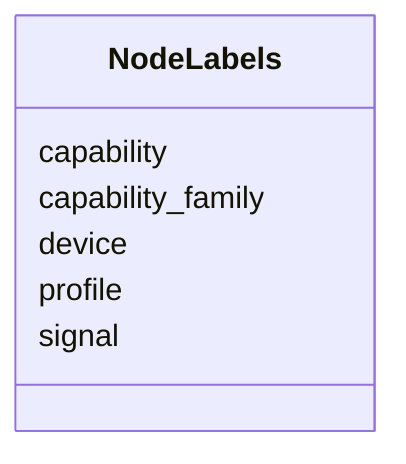

# Class: NodeLabels 


_Labels used when projecting the profile model into a graph view._


URI: [https://w3id.org/narad_linkml/schema/narad/schema/NodeLabels](https://w3id.org/narad_linkml/schema/narad/schema/NodeLabels)





<!-- no inheritance hierarchy -->


## Slots

| Name | Cardinality and Range | Description | Inheritance |
| ---  | --- | --- | --- |
| [device](device.md) | 0..1 <br/> [String](String.md) |  | direct |
| [capability_family](capability_family.md) | 0..1 <br/> [String](String.md) |  | direct |
| [profile](profile.md) | 0..1 <br/> [String](String.md) |  | direct |
| [capability](capability.md) | 0..1 <br/> [String](String.md) |  | direct |
| [signal](signal.md) | 0..1 <br/> [String](String.md) |  | direct |


## Usages

| used by | used in | type | used |
| ---  | --- | --- | --- |
| [GraphProjection](GraphProjection.md) | [node_labels](node_labels.md) | range | [NodeLabels](NodeLabels.md) |


## Identifier and Mapping Information


### Schema Source


* from schema: https://w3id.org/narad_linkml/schema/narad/schema


## Mappings

| Mapping Type | Mapped Value |
| ---  | ---  |
| self | https://w3id.org/narad_linkml/schema/narad/schema/NodeLabels |
| native | https://w3id.org/narad_linkml/schema/narad/schema/NodeLabels |


## LinkML Source

<!-- TODO: investigate https://stackoverflow.com/questions/37606292/how-to-create-tabbed-code-blocks-in-mkdocs-or-sphinx -->

### Direct

<details>
```yaml
name: NodeLabels
description: Labels used when projecting the profile model into a graph view.
from_schema: https://w3id.org/narad_linkml/schema/narad/schema
slots:
- device
- capability_family
- profile
- capability
- signal

```
</details>

### Induced

<details>
```yaml
name: NodeLabels
description: Labels used when projecting the profile model into a graph view.
from_schema: https://w3id.org/narad_linkml/schema/narad/schema
attributes:
  device:
    name: device
    from_schema: https://w3id.org/narad_linkml/schema/narad/schema
    rank: 1000
    alias: device
    owner: NodeLabels
    domain_of:
    - NodeLabels
    range: string
  capability_family:
    name: capability_family
    from_schema: https://w3id.org/narad_linkml/schema/narad/schema
    rank: 1000
    alias: capability_family
    owner: NodeLabels
    domain_of:
    - NodeLabels
    range: string
  profile:
    name: profile
    from_schema: https://w3id.org/narad_linkml/schema/narad/schema
    rank: 1000
    alias: profile
    owner: NodeLabels
    domain_of:
    - NodeLabels
    range: string
  capability:
    name: capability
    from_schema: https://w3id.org/narad_linkml/schema/narad/schema
    rank: 1000
    alias: capability
    owner: NodeLabels
    domain_of:
    - NodeLabels
    range: string
  signal:
    name: signal
    from_schema: https://w3id.org/narad_linkml/schema/narad/schema
    rank: 1000
    alias: signal
    owner: NodeLabels
    domain_of:
    - NodeLabels
    range: string

```
</details>