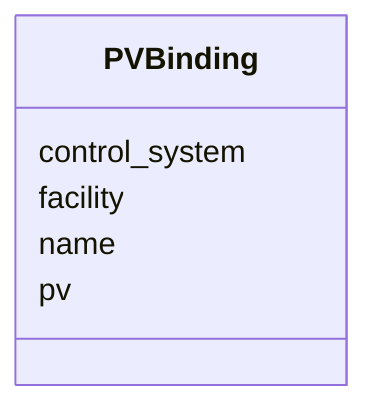

# Class: PVBinding 


_A concrete PV (Process Variable) binding for one semantic signal on a beamline element._


URI: [https://w3id.org/narad_linkml/schema/narad/schema/PVBinding](https://w3id.org/narad_linkml/schema/narad/schema/PVBinding)





<!-- no inheritance hierarchy -->


## Slots

| Name | Cardinality and Range | Description | Inheritance |
| ---  | --- | --- | --- |
| [name](name.md) | 1 <br/> [String](String.md) | Name/identifier of the entity | direct |
| [facility](facility.md) | 0..1 <br/> [String](String.md) |  | direct |
| [control_system](control_system.md) | 0..1 <br/> [String](String.md) |  | direct |
| [pv](pv.md) | 0..1 <br/> [String](String.md) | The EPICS Process Variable name (e | direct |


## Usages

| used by | used in | type | used |
| ---  | --- | --- | --- |
| [ElementNaradRef](ElementNaradRef.md) | [signal_bindings](signal_bindings.md) | range | [PVBinding](PVBinding.md) |


## Identifier and Mapping Information


### Schema Source


* from schema: https://w3id.org/narad_linkml/schema/narad/schema


## Mappings

| Mapping Type | Mapped Value |
| ---  | ---  |
| self | https://w3id.org/narad_linkml/schema/narad/schema/PVBinding |
| native | https://w3id.org/narad_linkml/schema/narad/schema/PVBinding |


## LinkML Source

<!-- TODO: investigate https://stackoverflow.com/questions/37606292/how-to-create-tabbed-code-blocks-in-mkdocs-or-sphinx -->

### Direct

<details>
```yaml
name: PVBinding
description: A concrete PV (Process Variable) binding for one semantic signal on a
  beamline element.
from_schema: https://w3id.org/narad_linkml/schema/narad/schema
slots:
- name
- facility
- control_system
- pv

```
</details>

### Induced

<details>
```yaml
name: PVBinding
description: A concrete PV (Process Variable) binding for one semantic signal on a
  beamline element.
from_schema: https://w3id.org/narad_linkml/schema/narad/schema
attributes:
  name:
    name: name
    description: Name/identifier of the entity.
    from_schema: https://w3id.org/narad_linkml/schema/narad/schema
    rank: 1000
    identifier: true
    alias: name
    owner: PVBinding
    domain_of:
    - Facility
    - SignalBinding
    - DeviceTypeSignalSet
    - Signal
    - Capability
    - CapabilityProfile
    - ControlProfileFamily
    - Beamline
    - BeamlineElement
    - PVBinding
    - KeyValuePair
    range: string
    required: true
  facility:
    name: facility
    from_schema: https://w3id.org/narad_linkml/schema/narad/schema
    rank: 1000
    alias: facility
    owner: PVBinding
    domain_of:
    - NaradConfig
    - PVBinding
    range: string
  control_system:
    name: control_system
    from_schema: https://w3id.org/narad_linkml/schema/narad/schema
    rank: 1000
    alias: control_system
    owner: PVBinding
    domain_of:
    - NaradConfig
    - Facility
    - PVBinding
    range: string
  pv:
    name: pv
    description: The EPICS Process Variable name (e.g. MBHK101H.S).
    from_schema: https://w3id.org/narad_linkml/schema/narad/schema
    rank: 1000
    alias: pv
    owner: PVBinding
    domain_of:
    - PVBinding
    range: string

```
</details>