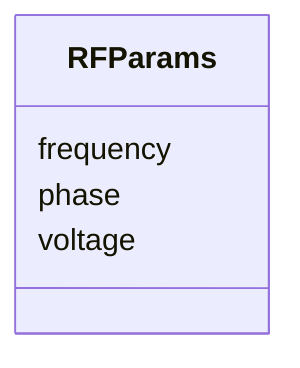

# Class: RFParams 


_RF cavity physics parameters (frequency, voltage, phase)._


URI: [https://w3id.org/narad_linkml/schema/narad/schema/RFParams](https://w3id.org/narad_linkml/schema/narad/schema/RFParams)





<!-- no inheritance hierarchy -->


## Slots

| Name | Cardinality and Range | Description | Inheritance |
| ---  | --- | --- | --- |
| [frequency](frequency.md) | 0..1 <br/> [Float](Float.md) | RF frequency in Hz | direct |
| [voltage](voltage.md) | 0..1 <br/> [Float](Float.md) | RF voltage in volts | direct |
| [phase](phase.md) | 0..1 <br/> [Float](Float.md) | RF phase in degrees | direct |


## Usages

| used by | used in | type | used |
| ---  | --- | --- | --- |
| [BeamlineElement](BeamlineElement.md) | [RFP](RFP.md) | range | [RFParams](RFParams.md) |


## Identifier and Mapping Information


### Schema Source


* from schema: https://w3id.org/narad_linkml/schema/narad/schema


## Mappings

| Mapping Type | Mapped Value |
| ---  | ---  |
| self | https://w3id.org/narad_linkml/schema/narad/schema/RFParams |
| native | https://w3id.org/narad_linkml/schema/narad/schema/RFParams |


## LinkML Source

<!-- TODO: investigate https://stackoverflow.com/questions/37606292/how-to-create-tabbed-code-blocks-in-mkdocs-or-sphinx -->

### Direct

<details>
```yaml
name: RFParams
description: RF cavity physics parameters (frequency, voltage, phase).
from_schema: https://w3id.org/narad_linkml/schema/narad/schema
slots:
- frequency
- voltage
- phase

```
</details>

### Induced

<details>
```yaml
name: RFParams
description: RF cavity physics parameters (frequency, voltage, phase).
from_schema: https://w3id.org/narad_linkml/schema/narad/schema
attributes:
  frequency:
    name: frequency
    description: RF frequency in Hz.
    from_schema: https://w3id.org/narad_linkml/schema/narad/schema
    rank: 1000
    alias: frequency
    owner: RFParams
    domain_of:
    - RFParams
    range: float
  voltage:
    name: voltage
    description: RF voltage in volts.
    from_schema: https://w3id.org/narad_linkml/schema/narad/schema
    rank: 1000
    alias: voltage
    owner: RFParams
    domain_of:
    - RFParams
    range: float
  phase:
    name: phase
    description: RF phase in degrees.
    from_schema: https://w3id.org/narad_linkml/schema/narad/schema
    rank: 1000
    alias: phase
    owner: RFParams
    domain_of:
    - RFParams
    range: float

```
</details>