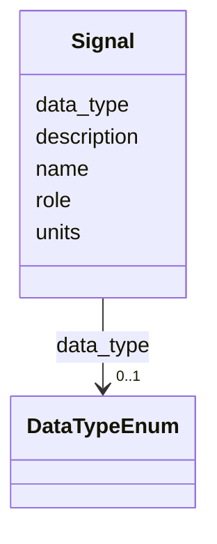

# Class: Signal 


_A named semantic signal used by a capability._


URI: [sosa:ObservableProperty](http://www.w3.org/ns/sosa/ObservableProperty)





<!-- no inheritance hierarchy -->


## Slots

| Name | Cardinality and Range | Description | Inheritance |
| ---  | --- | --- | --- |
| [name](name.md) | 1 <br/> [String](String.md) | Name/identifier of the entity | direct |
| [role](role.md) | 0..1 <br/> [String](String.md) | The role of the signal in the control model | direct |
| [data_type](data_type.md) | 0..1 <br/> [DataTypeEnum](DataTypeEnum.md) | The data type of the signal's value | direct |
| [units](units.md) | 0..1 <br/> [String](String.md) | Units of measurement or null for unitless values | direct |
| [description](description.md) | 0..1 <br/> [String](String.md) |  | direct |


## Usages

| used by | used in | type | used |
| ---  | --- | --- | --- |
| [Capability](Capability.md) | [signals](signals.md) | range | [Signal](Signal.md) |
| [TypeSpecificCapability](TypeSpecificCapability.md) | [signals](signals.md) | range | [Signal](Signal.md) |


## Aliases


* epics_pv
* pv
* process_variable
* EPICS Process Variable


## Identifier and Mapping Information


### Schema Source


* from schema: https://w3id.org/narad_linkml/schema/narad/schema


## Mappings

| Mapping Type | Mapped Value |
| ---  | ---  |
| self | sosa:ObservableProperty |
| native | https://w3id.org/narad_linkml/schema/narad/schema/Signal |
| broad | qudt:QuantityKind |


## LinkML Source

<!-- TODO: investigate https://stackoverflow.com/questions/37606292/how-to-create-tabbed-code-blocks-in-mkdocs-or-sphinx -->

### Direct

<details>
```yaml
name: Signal
description: A named semantic signal used by a capability.
from_schema: https://w3id.org/narad_linkml/schema/narad/schema
aliases:
- epics_pv
- pv
- process_variable
- EPICS Process Variable
broad_mappings:
- qudt:QuantityKind
slots:
- name
- role
- data_type
- units
- description
class_uri: sosa:ObservableProperty

```
</details>

### Induced

<details>
```yaml
name: Signal
description: A named semantic signal used by a capability.
from_schema: https://w3id.org/narad_linkml/schema/narad/schema
aliases:
- epics_pv
- pv
- process_variable
- EPICS Process Variable
broad_mappings:
- qudt:QuantityKind
attributes:
  name:
    name: name
    description: Name/identifier of the entity.
    from_schema: https://w3id.org/narad_linkml/schema/narad/schema
    rank: 1000
    identifier: true
    alias: name
    owner: Signal
    domain_of:
    - Facility
    - SignalBinding
    - DeviceTypeSignalSet
    - Signal
    - Capability
    - CapabilityProfile
    - ControlProfileFamily
    - Beamline
    - BeamlineElement
    - PVBinding
    - KeyValuePair
    range: string
    required: true
  role:
    name: role
    description: The role of the signal in the control model.
    from_schema: https://w3id.org/narad_linkml/schema/narad/schema
    rank: 1000
    alias: role
    owner: Signal
    domain_of:
    - Signal
    range: string
  data_type:
    name: data_type
    description: The data type of the signal's value.
    from_schema: https://w3id.org/narad_linkml/schema/narad/schema
    broad_mappings:
    - ncit:C42645
    - qudt:Datatype
    rank: 1000
    alias: data_type
    owner: Signal
    domain_of:
    - Signal
    range: DataTypeEnum
  units:
    name: units
    description: Units of measurement or null for unitless values.
    from_schema: https://w3id.org/narad_linkml/schema/narad/schema
    broad_mappings:
    - si-unit:Unit
    rank: 1000
    alias: units
    owner: Signal
    domain_of:
    - Signal
    range: string
  description:
    name: description
    from_schema: https://w3id.org/narad_linkml/schema/narad/schema
    rank: 1000
    alias: description
    owner: Signal
    domain_of:
    - SignalBinding
    - Signal
    - Capability
    - TypeSpecificCapability
    - CapabilityProfile
    - ControlProfileFamily
    range: string
class_uri: sosa:ObservableProperty

```
</details>