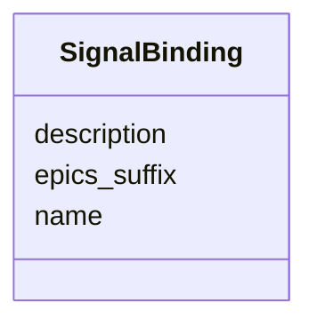

# Class: SignalBinding 


_A named EPICS suffix definition for one semantic signal._


URI: [https://w3id.org/narad_linkml/schema/narad/schema/SignalBinding](https://w3id.org/narad_linkml/schema/narad/schema/SignalBinding)





<!-- no inheritance hierarchy -->


## Slots

| Name | Cardinality and Range | Description | Inheritance |
| ---  | --- | --- | --- |
| [name](name.md) | 1 <br/> [String](String.md) | Name/identifier of the entity | direct |
| [epics_suffix](epics_suffix.md) | 0..1 <br/> [String](String.md) | Facility-specific EPICS suffix for a semantic signal | direct |
| [description](description.md) | 0..1 <br/> [String](String.md) |  | direct |


## Usages

| used by | used in | type | used |
| ---  | --- | --- | --- |
| [SignalDefinitions](SignalDefinitions.md) | [shared_magnet_signals](shared_magnet_signals.md) | range | [SignalBinding](SignalBinding.md) |
| [SignalDefinitions](SignalDefinitions.md) | [cavity_signals](cavity_signals.md) | range | [SignalBinding](SignalBinding.md) |
| [DeviceTypeSignalSet](DeviceTypeSignalSet.md) | [signal_bindings](signal_bindings.md) | range | [SignalBinding](SignalBinding.md) |


## Identifier and Mapping Information


### Schema Source


* from schema: https://w3id.org/narad_linkml/schema/narad/schema


## Mappings

| Mapping Type | Mapped Value |
| ---  | ---  |
| self | https://w3id.org/narad_linkml/schema/narad/schema/SignalBinding |
| native | https://w3id.org/narad_linkml/schema/narad/schema/SignalBinding |


## LinkML Source

<!-- TODO: investigate https://stackoverflow.com/questions/37606292/how-to-create-tabbed-code-blocks-in-mkdocs-or-sphinx -->

### Direct

<details>
```yaml
name: SignalBinding
description: A named EPICS suffix definition for one semantic signal.
from_schema: https://w3id.org/narad_linkml/schema/narad/schema
slots:
- name
- epics_suffix
- description

```
</details>

### Induced

<details>
```yaml
name: SignalBinding
description: A named EPICS suffix definition for one semantic signal.
from_schema: https://w3id.org/narad_linkml/schema/narad/schema
attributes:
  name:
    name: name
    description: Name/identifier of the entity.
    from_schema: https://w3id.org/narad_linkml/schema/narad/schema
    rank: 1000
    identifier: true
    alias: name
    owner: SignalBinding
    domain_of:
    - Facility
    - SignalBinding
    - DeviceTypeSignalSet
    - Signal
    - Capability
    - CapabilityProfile
    - ControlProfileFamily
    - Beamline
    - BeamlineElement
    - PVBinding
    - KeyValuePair
    range: string
    required: true
  epics_suffix:
    name: epics_suffix
    description: Facility-specific EPICS suffix for a semantic signal.
    from_schema: https://w3id.org/narad_linkml/schema/narad/schema
    rank: 1000
    alias: epics_suffix
    owner: SignalBinding
    domain_of:
    - SignalBinding
    range: string
  description:
    name: description
    from_schema: https://w3id.org/narad_linkml/schema/narad/schema
    rank: 1000
    alias: description
    owner: SignalBinding
    domain_of:
    - SignalBinding
    - Signal
    - Capability
    - TypeSpecificCapability
    - CapabilityProfile
    - ControlProfileFamily
    range: string

```
</details>