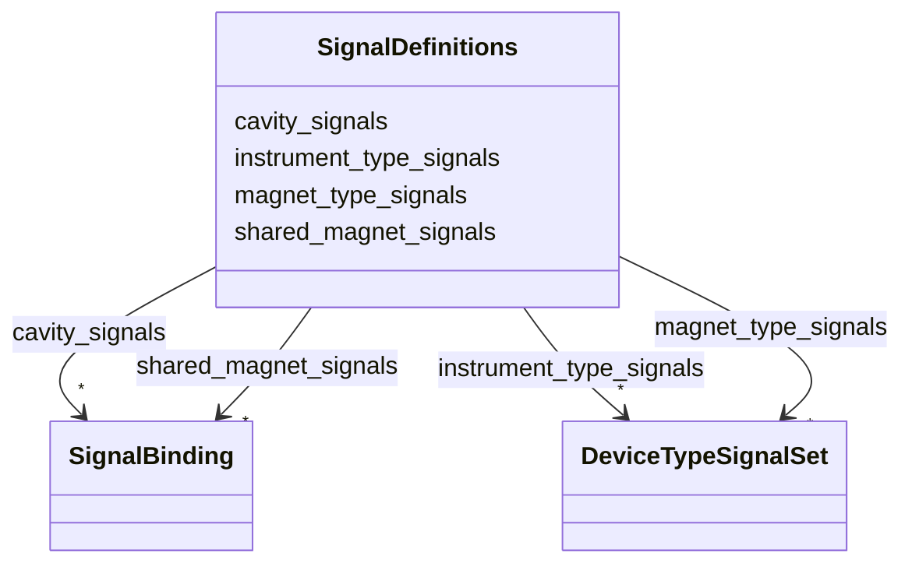

# Class: SignalDefinitions 


_Grouped EPICS signal suffix templates by semantic category._


URI: [https://w3id.org/narad_linkml/schema/narad/schema/SignalDefinitions](https://w3id.org/narad_linkml/schema/narad/schema/SignalDefinitions)





<!-- no inheritance hierarchy -->


## Slots

| Name | Cardinality and Range | Description | Inheritance |
| ---  | --- | --- | --- |
| [shared_magnet_signals](shared_magnet_signals.md) | * <br/> [SignalBinding](SignalBinding.md) | Shared magnet signal definitions keyed by signal name | direct |
| [magnet_type_signals](magnet_type_signals.md) | * <br/> [DeviceTypeSignalSet](DeviceTypeSignalSet.md) | Magnet-type-specific signal definition groups keyed by device type | direct |
| [instrument_type_signals](instrument_type_signals.md) | * <br/> [DeviceTypeSignalSet](DeviceTypeSignalSet.md) | Instrument-type-specific signal definition groups keyed by device type | direct |
| [cavity_signals](cavity_signals.md) | * <br/> [SignalBinding](SignalBinding.md) | Cavity signal definitions keyed by signal name | direct |


## Usages

| used by | used in | type | used |
| ---  | --- | --- | --- |
| [Facility](Facility.md) | [signal_definitions](signal_definitions.md) | range | [SignalDefinitions](SignalDefinitions.md) |


## Identifier and Mapping Information


### Schema Source


* from schema: https://w3id.org/narad_linkml/schema/narad/schema


## Mappings

| Mapping Type | Mapped Value |
| ---  | ---  |
| self | https://w3id.org/narad_linkml/schema/narad/schema/SignalDefinitions |
| native | https://w3id.org/narad_linkml/schema/narad/schema/SignalDefinitions |


## LinkML Source

<!-- TODO: investigate https://stackoverflow.com/questions/37606292/how-to-create-tabbed-code-blocks-in-mkdocs-or-sphinx -->

### Direct

<details>
```yaml
name: SignalDefinitions
description: Grouped EPICS signal suffix templates by semantic category.
from_schema: https://w3id.org/narad_linkml/schema/narad/schema
slots:
- shared_magnet_signals
- magnet_type_signals
- instrument_type_signals
- cavity_signals

```
</details>

### Induced

<details>
```yaml
name: SignalDefinitions
description: Grouped EPICS signal suffix templates by semantic category.
from_schema: https://w3id.org/narad_linkml/schema/narad/schema
attributes:
  shared_magnet_signals:
    name: shared_magnet_signals
    description: Shared magnet signal definitions keyed by signal name.
    from_schema: https://w3id.org/narad_linkml/schema/narad/schema
    rank: 1000
    alias: shared_magnet_signals
    owner: SignalDefinitions
    domain_of:
    - SignalDefinitions
    range: SignalBinding
    multivalued: true
    inlined: true
  magnet_type_signals:
    name: magnet_type_signals
    description: Magnet-type-specific signal definition groups keyed by device type.
    from_schema: https://w3id.org/narad_linkml/schema/narad/schema
    rank: 1000
    alias: magnet_type_signals
    owner: SignalDefinitions
    domain_of:
    - SignalDefinitions
    range: DeviceTypeSignalSet
    multivalued: true
    inlined: true
  instrument_type_signals:
    name: instrument_type_signals
    description: Instrument-type-specific signal definition groups keyed by device
      type.
    from_schema: https://w3id.org/narad_linkml/schema/narad/schema
    rank: 1000
    alias: instrument_type_signals
    owner: SignalDefinitions
    domain_of:
    - SignalDefinitions
    range: DeviceTypeSignalSet
    multivalued: true
    inlined: true
  cavity_signals:
    name: cavity_signals
    description: Cavity signal definitions keyed by signal name.
    from_schema: https://w3id.org/narad_linkml/schema/narad/schema
    rank: 1000
    alias: cavity_signals
    owner: SignalDefinitions
    domain_of:
    - SignalDefinitions
    range: SignalBinding
    multivalued: true
    inlined: true

```
</details>