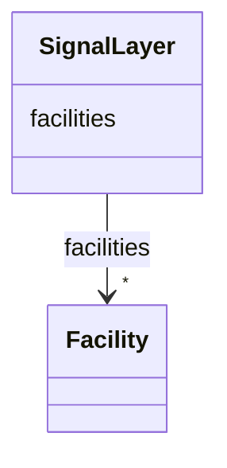

# Class: SignalLayer 


_Signal-layer container for facility-specific signal bindings._


URI: [https://w3id.org/narad_linkml/schema/narad/schema/SignalLayer](https://w3id.org/narad_linkml/schema/narad/schema/SignalLayer)





<!-- no inheritance hierarchy -->


## Slots

| Name | Cardinality and Range | Description | Inheritance |
| ---  | --- | --- | --- |
| [facilities](facilities.md) | * <br/> [Facility](Facility.md) | Facility identifiers for facility-specific signal bindings | direct |


## Usages

| used by | used in | type | used |
| ---  | --- | --- | --- |
| [NaradConfig](NaradConfig.md) | [signal_layer](signal_layer.md) | range | [SignalLayer](SignalLayer.md) |


## Identifier and Mapping Information


### Schema Source


* from schema: https://w3id.org/narad_linkml/schema/narad/schema


## Mappings

| Mapping Type | Mapped Value |
| ---  | ---  |
| self | https://w3id.org/narad_linkml/schema/narad/schema/SignalLayer |
| native | https://w3id.org/narad_linkml/schema/narad/schema/SignalLayer |


## LinkML Source

<!-- TODO: investigate https://stackoverflow.com/questions/37606292/how-to-create-tabbed-code-blocks-in-mkdocs-or-sphinx -->

### Direct

<details>
```yaml
name: SignalLayer
description: Signal-layer container for facility-specific signal bindings.
from_schema: https://w3id.org/narad_linkml/schema/narad/schema
slots:
- facilities

```
</details>

### Induced

<details>
```yaml
name: SignalLayer
description: Signal-layer container for facility-specific signal bindings.
from_schema: https://w3id.org/narad_linkml/schema/narad/schema
attributes:
  facilities:
    name: facilities
    description: Facility identifiers for facility-specific signal bindings.
    from_schema: https://w3id.org/narad_linkml/schema/narad/schema
    rank: 1000
    alias: facilities
    owner: SignalLayer
    domain_of:
    - SignalLayer
    range: Facility
    multivalued: true
    inlined: true

```
</details>