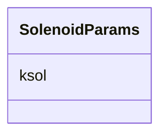

# Class: SolenoidParams 


_Solenoid physics parameters._


URI: [https://w3id.org/narad_linkml/schema/narad/schema/SolenoidParams](https://w3id.org/narad_linkml/schema/narad/schema/SolenoidParams)





<!-- no inheritance hierarchy -->


## Slots

| Name | Cardinality and Range | Description | Inheritance |
| ---  | --- | --- | --- |
| [ksol](ksol.md) | 0..1 <br/> [Float](Float.md) | Solenoid integrated field strength | direct |


## Usages

| used by | used in | type | used |
| ---  | --- | --- | --- |
| [BeamlineElement](BeamlineElement.md) | [SolenoidP](SolenoidP.md) | range | [SolenoidParams](SolenoidParams.md) |


## Identifier and Mapping Information


### Schema Source


* from schema: https://w3id.org/narad_linkml/schema/narad/schema


## Mappings

| Mapping Type | Mapped Value |
| ---  | ---  |
| self | https://w3id.org/narad_linkml/schema/narad/schema/SolenoidParams |
| native | https://w3id.org/narad_linkml/schema/narad/schema/SolenoidParams |


## LinkML Source

<!-- TODO: investigate https://stackoverflow.com/questions/37606292/how-to-create-tabbed-code-blocks-in-mkdocs-or-sphinx -->

### Direct

<details>
```yaml
name: SolenoidParams
description: Solenoid physics parameters.
from_schema: https://w3id.org/narad_linkml/schema/narad/schema
slots:
- ksol

```
</details>

### Induced

<details>
```yaml
name: SolenoidParams
description: Solenoid physics parameters.
from_schema: https://w3id.org/narad_linkml/schema/narad/schema
attributes:
  ksol:
    name: ksol
    description: Solenoid integrated field strength.
    from_schema: https://w3id.org/narad_linkml/schema/narad/schema
    rank: 1000
    alias: ksol
    owner: SolenoidParams
    domain_of:
    - SolenoidParams
    range: float

```
</details>