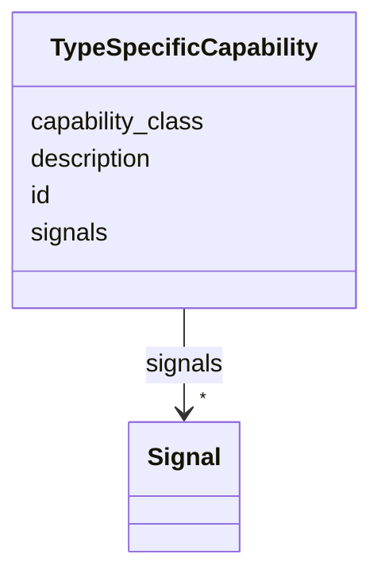

# Class: TypeSpecificCapability 


_An inline capability declared within a device-type profile, with its own identifier, a semantic class label, a description, and a list of signals. Distinct from the shared capabilities referenced by name; these are profile-local definitions._


URI: [https://w3id.org/narad_linkml/schema/narad/schema/TypeSpecificCapability](https://w3id.org/narad_linkml/schema/narad/schema/TypeSpecificCapability)





<!-- no inheritance hierarchy -->


## Slots

| Name | Cardinality and Range | Description | Inheritance |
| ---  | --- | --- | --- |
| [id](id.md) | 1 <br/> [String](String.md) | Unique identifier for the entity | direct |
| [capability_class](capability_class.md) | 0..1 <br/> [String](String.md) | Semantic class label for a type-specific capability (e | direct |
| [description](description.md) | 0..1 <br/> [String](String.md) |  | direct |
| [signals](signals.md) | * <br/> [Signal](Signal.md) | Signals within a capability | direct |


## Usages

| used by | used in | type | used |
| ---  | --- | --- | --- |
| [CapabilityProfile](CapabilityProfile.md) | [type_specific_capabilities](type_specific_capabilities.md) | range | [TypeSpecificCapability](TypeSpecificCapability.md) |
| [ElementSemantics](ElementSemantics.md) | [type_specific_capabilities](type_specific_capabilities.md) | range | [TypeSpecificCapability](TypeSpecificCapability.md) |


## Identifier and Mapping Information


### Schema Source


* from schema: https://w3id.org/narad_linkml/schema/narad/schema


## Mappings

| Mapping Type | Mapped Value |
| ---  | ---  |
| self | https://w3id.org/narad_linkml/schema/narad/schema/TypeSpecificCapability |
| native | https://w3id.org/narad_linkml/schema/narad/schema/TypeSpecificCapability |


## LinkML Source

<!-- TODO: investigate https://stackoverflow.com/questions/37606292/how-to-create-tabbed-code-blocks-in-mkdocs-or-sphinx -->

### Direct

<details>
```yaml
name: TypeSpecificCapability
description: An inline capability declared within a device-type profile, with its
  own identifier, a semantic class label, a description, and a list of signals. Distinct
  from the shared capabilities referenced by name; these are profile-local definitions.
from_schema: https://w3id.org/narad_linkml/schema/narad/schema
slots:
- id
- capability_class
- description
- signals

```
</details>

### Induced

<details>
```yaml
name: TypeSpecificCapability
description: An inline capability declared within a device-type profile, with its
  own identifier, a semantic class label, a description, and a list of signals. Distinct
  from the shared capabilities referenced by name; these are profile-local definitions.
from_schema: https://w3id.org/narad_linkml/schema/narad/schema
attributes:
  id:
    name: id
    description: Unique identifier for the entity.
    from_schema: https://w3id.org/narad_linkml/schema/narad/schema
    rank: 1000
    identifier: true
    alias: id
    owner: TypeSpecificCapability
    domain_of:
    - TypeSpecificCapability
    range: string
    required: true
  capability_class:
    name: capability_class
    description: Semantic class label for a type-specific capability (e.g. QuadrupoleStrengthCapability).
      Serialized as 'class' in source YAML; renamed here to avoid conflict with reserved
      keywords.
    from_schema: https://w3id.org/narad_linkml/schema/narad/schema
    aliases:
    - class
    rank: 1000
    alias: capability_class
    owner: TypeSpecificCapability
    domain_of:
    - TypeSpecificCapability
    range: string
  description:
    name: description
    from_schema: https://w3id.org/narad_linkml/schema/narad/schema
    rank: 1000
    alias: description
    owner: TypeSpecificCapability
    domain_of:
    - SignalBinding
    - Signal
    - Capability
    - TypeSpecificCapability
    - CapabilityProfile
    - ControlProfileFamily
    range: string
  signals:
    name: signals
    description: Signals within a capability.
    from_schema: https://w3id.org/narad_linkml/schema/narad/schema
    rank: 1000
    alias: signals
    owner: TypeSpecificCapability
    domain_of:
    - Capability
    - TypeSpecificCapability
    range: Signal
    multivalued: true
    inlined: true
    inlined_as_list: true

```
</details>